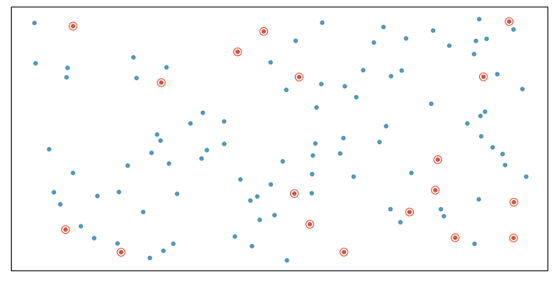
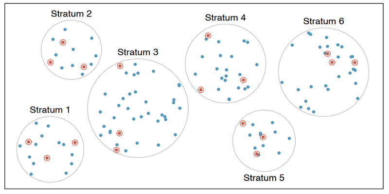

---
output:
  pdf_document: default
  html_document: default
  documentclass: book
  learnr::tutorial:
    progressive: TRUE
  exams2forms: webquiz
---

# Introduction to Data

## Data Types

### Objectives

By the end of this section, students will be able to:

::: {.blue-background}
- Understand the importance of statistical methods for answering research questions using data.
- Identify different types of data that can be analyzed using statistical methods.
- Describe basic sampling principles and strategies for the purpose of collecting data for research studies.
- Describe basic principles of designing research experiments.
:::

### Overview

In this section, we will delve deeper into the categorization of variables as **numerical and categorical**. This is an important step, as the type of variable helps us determine what summary statistics to calculate, what type of visualizations to make, and what statistical method will be appropriate to answer the research questions we're exploring.

There are two types of variables: numerical and categorical.

- **Numerical**, in other words, quantitative, variables take on numerical values. It is sensible to add, subtract, take averages, and so on, with these values.

- **Categorical**, or qualitative, variables, take on a limited number of distinct categories. These categories can be identified with numbers, for example, it is customary to see likert variables (strongly agree to strongly disagree) coded as 1 through 5, but it wouldn't be sensible to do arithmetic operations with these values. They are merely placeholders for the levels of the categorical variable.

**Numerical data**

Numerical variables can be further categorized as **continuous or discrete**.

- **Continuous numerical** variables are usually measured, such as height. These variables can take on an infinite number of values within a given range.

- **Discrete numerical** variables are those that take on one of a specific set of numeric values where we are able to count or enumerate all of the possibilities. One example of a discrete variable is number of pets in a household. In general, count data are an example of discrete variables.

When determining whether a numerical variable is continuous or discrete, it is important to think about the nature of the variable and not just the observed value, as rounding of continuous variables can make them appear to be discrete. For example, height is a continuous variable, however we tend to report our height rounded to the nearest unit of measure, like inches or centimeters.

**Categorical data**

Categorical variables that have ordered levels are called **ordinal**.

Think about a survey question where you're asked how satisfied you are with the customer service you received and the options are very unsatisfied, unsatisfied, neutral, satisfied, and very satisfied. These levels have an inherent ordering, hence the variable would be called ordinal.

If the levels of a categorical variable do not have an inherent ordering to them, then the variable is simply called categorical. For example, do you consume caffeine or not?

**Data collection principles**

**Population versus Sample**: In statistics, we almost always want to apply generalizations from a small sample to a large population -- you might think of this as a sort of *stereotyping*. The trick here is that for our assertions (generalizations) to be valid, our sample must be *representative of* our population.

 **The following takeaway is critical:** *Results based off of a sample may only be generalized to a population for which that sample is representative.* 

 

**Why not take a census?**

First, taking a census requires a lot more resources than collecting data from a sample of the population.

Second, certain individuals in your population might be hard to locate or collect data from. If these individuals that are missed in the census are different from those in the rest of the population, the census data will be biased. For example, in the US census, undocumented immigrants are often not recorded properly since they tend to be reluctant to fill out census forms with the concern that this information could be shared with immigration. However, these individuals might have characteristics different than the rest of the population and hence, not getting information from them might result in unreliable data from geographical regions with high concentrations of undocumented immigrants.

Lastly, populations are constantly changing. Even if you do have the required resources and manage to collect data from everyone in the population, tomorrow your population will be different and so the hard work required to collect such data may not pay off.

If you think about it, sampling is actually quite natural.

**Sampling is natural**

Think about something you are cooking we taste or in other words examine a small part of what we're cooking to get an idea about the dish as a whole. After all, we would never eat a whole pot of soup just to check its taste.

When you taste a spoonful of soup and decide the spoonful you tasted isn't salty enough, what you're doing is simply exploratory analysis for the sample at hand.

If you then generalize and conclude that your entire soup needs salt, that's making an inference.

For your inference to be valid, the spoonful you tasted, your sample, needs to be representative of the entire pot, your population.

If your spoonful comes only from the surface and the salt is collected at the bottom of the pot, what you tasted is probably not going to be representative of the whole pot.

On the other hand, if you first stir the soup thoroughly before you taste, your spoonful will more likely be representative of the whole pot.

Sampling data is a bit different than sampling soup though. 

**Steps to Sampling:**

1)  Identify the research question (then determine the population)

2)  Collect data that are reliable and help achieve the research goal (take good samples)

-   Population and sample
    -   A population is the entire group that you want to draw conclusions about.
    -   A sample is the specific group that you will collect data from
-   Parameter and Statistic
    -   A descriptive measure (for example, average, median, standard deviation and percentages) for an entire population is a ''**parameter.**''
    -   A descriptive measure for a sample is referred to as a ''**sample statistic**''
-   Observational studies and Experiments
    -   Observational studies: research processes where researchers collect data in a way that does not directly interfere with how the data arise (examine something without manipulating it)
    -   Experiment: Researchers randomly assign subjects to various treatments in order to establish causal connections between the explanatory and response variables

Four commonly used random sampling techniques:

    -   Simple random sampling

    -   Stratified sample

    -   Cluster sampling

    -   Multistage sampling

So next, we'll introduce a few commonly used sampling methods: simple random sampling, stratified sampling, cluster sampling, and multistage sampling.

**Sampling Methods**

Here we discuss some of the different ways to draw a sample from a population.

**Simple random sample**

In *simple random* sampling, we randomly select cases from the population, such that each case is equally likely to be selected. This is similar to randomly drawing names from a hat.

  

**Stratified sample**

In *stratified sampling*, we first divide the population into homogeneous groups, called strata, and then we randomly sample from within each stratum. For example, if we wanted to make sure that people from low, medium, and high socioeconomic status are equally represented in a study, we would first divide our population into three groups as such and then sample from within each group.

  

**Cluster sample**

In cluster sampling, we divide the population into clusters, randomly sample a few clusters, and then sample all observations within these clusters. The clusters, unlike strata in stratified sampling, are heterogeneous within themselves and each cluster is similar to the others, such that we can get away with sampling from just a few of the clusters.

  

**Multistage sample**

Multistage sampling adds another step to cluster sampling. Just like in cluster sampling, we divide the population into clusters, randomly sample a few clusters, and then we randomly sample observations from within those clusters.

  

Note: Cluster and multistage sampling are often used for economical reasons. For example, one might divide a city into geographic regions that are on average similar to each other and then sample randomly from a few randomly picked regions in order to avoid traveling to all regions.

**Convenience sample**

The *convenience sample* is the most commonly used sampling method. Unfortunately, it is also the worst. When researchers sample from individuals they have "easy access" to, they are conducting a convenience sample. There are always hidden biases in these samples. Do a quick Google search for "FDR versus Alf Landon Sampling Error" to see a very famous example here. In addition, much of the error in predicting the results of the 2016 presidential election may be attributable to convenience sampling.

**Sampling strategies, determine which**

A consulting company is planning a pilot study on marketing in Boston. They identify the zip codes that make up the greater Boston area, then sample 50 randomly selected addresses from each zip code and mail a coupon to these addresses. They then track whether the coupon was used in the following month.

**Sampling strategies, choose worst**

A school district has requested a survey be conducted on the socioeconomic status of their students. Their budget only allows them to conduct the survey in some of the schools, hence they need to first sample a few schools. 

Students living in this district generally attend a school in their neighborhood. The district is broken into many distinct and unique neighborhoods, some including large single-family homes and others with only low-income housing. 

**Experimental Design**

**Experiment versus Observational Study**: Beyond just sampling, there are multiple methods for collecting data. We can just *observe* what happens naturally (without manipulating any conditions) or we can run an *experiment*. In experiments we manipulate one or more conditions, utilizing a control and treatment group(s). The advantage to an experiment is that we can infer cause and effect relationships (this is extremely important in medical studies), but in observational studies we can only discuss an association between variables.

There's lots more to learn about experimental design, but it is beyond the scope of our course. You should read pages 32 through 35 of [OpenIntro Statistics, 4Ed](https://www.openintro.org/book/os/) as a starting point.

**Explanatory and response variables**

Often when one mentions "a relationship between variables" we think of a relationship between just two variables, say a so called explanatory variable, x, and response variable, y. However, truly understanding the relationship between two variables might require considering other potentially related variables as well. If we don't, we might find ourselves in a *Simpson's paradox*. So, what is Simpson's paradox?

First, let's clarify what we mean when we say explanatory and response variables. Labeling variables as explanatory and response does not guarantee the relationship between the two is actually causal, even if there is an association identified. We use these labels only to keep track of which variable we suspect affects the other.

**Explanatory and response**

{width="30%"}

And these definitions can be expanded to more than just two variables. For example, we could study the relationship between three explanatory variables and a single response variable.

**Multivariate relationships**

{width="50%"}

This is often a more realistic scenario since most real world relationships are multivariable. For example, if we're interested in the relationship between calories consumed daily and heart health, we would probably also want to consider information on variables like age and fitness level of the person as well.

{width="50%"}

Not considering an important variable when studying a relationship can result in what we call a **Simpson's paradox**. This paradox illustrates the effect the omission of an explanatory variable can have on the measure of association between another explanatory variable and the response variable. In other words, the inclusion of a third variable in the analysis can change the apparent relationship between the other two variables. 

Consider the eight dots in the scatter plot below (the points happen to fall on the orange and blue lines). The trend describing the points when only considering `x1` and `y`, illustrated by the black dashed line, is reversed when `x2`, the grouping variable, is also considered. If we don't consider `x2`, the relationship between `x1` and `y` is positive. If we do consider `x2`, we see that within each group the relationship between `x1` and `y` is actually negative.

{width="50%"}

We'll explore Simpson's paradox further with another dataset, which comes from a study carried out by the graduate Division of the University of California, Berkeley in the early 70’s to evaluate whether there was a sex bias in graduate admissions. The data come from six departments. For confidentiality we'll call them A through F. The dataset contains information on whether the applicant identified as male or female, recorded as `Gender`, and whether they were admitted or rejected, recorded as `Admit`. 

**Berkeley admission data**

       | Admitted | Rejected  
-------| ---------|---------
Male   | 1198     | 1493
Female | 557      | 1278

> Note: At the time of this study, gender and sexual identities were not given distinct names. Instead, it
> was common for a survey to ask for your "gender" and then provide you with the options of "male" and 
> "female." Today, we better understand how an individual's gender and sexual identities are different 
> pieces of who they are. To learn more about inclusive language surrounding gender and sexual identities 
> see the [gender unicorn](https://transstudent.org/gender/). 

4.  Principles of experimental design: 4 principles

-   Controlling (assign treatment and control groups, enforce specific treatment in treatment group)
-   Randomization (randomly assign treatment group and control group);
-   Replication (large sample, or replicate an entire study to verify earlier findings)
-   Blocking

### Solved Problems

**Exercises:**

**Exercise 1.** (page 11 #1.2) Researchers studying the effect of antibiotic treatment for acute sinusitis compared to symptomatic treatments randomly assigned 166 adults diagnosed with acute sinusitis to one of two groups: treatment or control. Study participants received either a 10-day course of amoxicillin (an antibiotic) or a placebo similar in appearance and taste. The placebo consisted of symptomatic treatments such as acetaminophen nasal decongestants, etc. At the end of the 10-day period, patients were asked if they experienced improvement in symptoms. The distribution of responses is summarized below (with some cells missing numbers):

*(for b), c), Round answers to within one hundredth of a percent)*

|               | Self-reported improved in symptoms |         |        |           |
|------------|------------------------|------------|------------|------------|
|               |                                    | **Yes** | **No** | **Total** |
| **Treatment** |                                    | 66      |        | 85        |
| **Control**   |                                    | 65      |        |           |
| **Total**     |                                    |         |        | 166       |

(a). Fill the blank cells in the above table.

(b). What percent of patients in the treatment group experienced improvement in symptoms?

(c). What percent experienced improvement in symptoms in the control group?

(d). In which group did a higher percentage of patients experience improvement in symptoms?

(e). Your findings so far might suggest a real difference in effectiveness of antibiotic and placebo treatments for improving symptoms of sinusitis. However, this is not the only possible conclusion that can be drawn based on your findings so far. What is one other possible explanation for the observed difference between the percentages of patients in the antibiotic and placebo treatment groups that experience improvement in symptoms of sinusitis?

**(Answers for reference:**

**(a).**

|               | Self-reported improved in symptoms |         |        |           |
|------------|------------------------|------------|------------|------------|
|               |                                    | **Yes** | **No** | **Total** |
| **Treatment** |                                    | 66      | 19     | 85        |
| **Control**   |                                    | 65      | 16     | 81        |
| **Total**     |                                    | 131     | 35     | 166       |

**(e).** Be careful: Do not generalize the results of this study. It is impossible to tell merely by comparing the sample proportions **because the difference could be the result of random error in our sample.**

**Exercise 2.** The following figure displays data from a lending company.

| loan.amount | interest.rate | term | grade | state | total.income | homeownership |
|-------------|---------------|------|-------|-------|--------------|---------------|
| 7500        | 7.34          | 36   | A     | MD    | 70000        | rent          |
| 25000       | 9.43          | 60   | B     | OH    | 254000       | mortgage      |
| 14500       | 6.08          | 36   | A     | MO    | 80000        | mortgage      |
| ...         | ...           | ...  | ...   | ...   | ...          | ...           |
| 3000        | 7.96          | 36   | A     | CA    | 34000        | rent          |

**Variable descriptions**

loan amount: Amount of the loan received, in US dollars.

interest rate: Interest rate on the loan, in an annual percentage.

term: The length of the loan, which is always set as a whole number of months.

grade: Loan grade, which takes a values A through G and represents the quality of the loan and its likelihood of being repaid.

state: US state where the borrower resides.

total income: Borrower’s total income, including any second income, in US dollars.

homeownership: Indicates whether the person owns, owns but has a mortgage, or rents.

(a). How many cases in the data?

(b). Identify the types of variables.

**Exercise 3.** (page 19 #1.4) The Buteyko method is a shallow breathing technique developed by Konstantin Buteyko, a Russian doctor, in 1952. Anecdotal evidence (evidence based only on personal observation) suggests that the Buteyko method can reduce asthma symptoms and improve quality of life. In a scientific study to determine the effectiveness of this method, researchers recruited 600 asthma patients aged 18-69 who relied on medication for asthma treatment. These patients were randomly split into two research groups: one practiced the Buteyko method and the other did not. Patients were scored on quality of life, activity, asthma symptoms, and medication reduction on a scale from 0 to 10. On average, the participants in the Buteyko group experienced a significant reduction in asthma symptoms and an improvement in quality of life.

(a). Identify the main research question of the study.

(b). Who are the subjects in this study and how many are included?

(c). What are the variables in the study? Identify each variable as numerical or categorical. If numerical, state whether the variable is discrete or continuous.

(Reference answer:

(a). The effect of Buteyko method on reducing asthma symptoms and improving quality of life.

(b). Asthma patients aged 18-69 who relied on medication for asthma treatment; 600.

(c). The variables and types are: quality of life (categorical), activity (categorical), asthma symptoms (categorical), and medication reduction on a scale from 0 to 10 (numerical discrete).)

**Exercise 4.** (page 29 #1.13) Exercise 1.3 introduces a study where researchers collected data to examine the relationship between air pollutants and preterm births in Southern California. During the study, air pollution levels were measured by air quality monitoring stations; lengths of gestation data were collected on 143,196 births between the years 1989 and 1993; and air pollution exposure during gestation was calculated for each birth.

(a). Identify the population of interest and the sample in this study.

(b). Comment on whether or not the results of the study can be generalized to the population and if the findings of the study can be used to establish causal relationships.

(Reference answer:

(a) Population: all births in Southern California. Sample: collected length of gestation data of 143,196 births between the years 1989 and 1993.

(b) If the collected lengths of gestation data of births in this time span and geography can be considered representative of all births, then the results are generalizable to the population of Southern California. However, since the study is observational, the findings cannot be used to establish causal relationships.)

**Exercise 5.** A fitness center is interested in the average amount of time a client exercises in the center each week. Match the vocabulary words (a-f) with its corresponding examples (1-6). (Note: 1-1 match)

Examples:

1.  All 45 exercise times that were recorded from the participants in the study.

2.  The 45 clients from the fitness center who participated in the study.

3.  All clients at the fitness center.

4.  The average amount of time that all clients from the fitness center exercise.

5.  The amount of time that any given client from the fitness center exercises.

6.  The average amount of exercise time for the 45 clients from the fitness center who participated in the study.

Vocabulary words:

a.  Data

b.  Population

c.  Variable

d.  Sample

e.  Parameter

f.  Statistic

**Exercise 6.** (Observational Study or Experiment)

a.  You would like to investigate whether listening to music while taking exams affects performance. A group of students are told to listen to music while taking a test and their results are compared to a group not listening to music. Is this an experiment or an observational study?

b.  The starting salaries of recent graduates from Ivy League private and public universities are recorded. Is this an experiment or an observational study?

**Exercise 7.** (page 37 #1.41) In a public health study on the effects of consumption of fruits and vegetables on psychological well-being in young adults, participants were randomly assigned to three groups: (1) diet as usual, (2) an ecological momentary intervention involving text message reminders to increase their fruits and vegetable consumption plus a voucher to purchase them, or (3) a fruit and vegetable intervention in which participants were given two additional daily servings of fresh fruits and vegetables to consume on top of their normal diet. Participants were asked to take a nightly survey on their smartphones. Participants were student volunteers at the University of Otago, New Zealand. At the end of the 14-day study, only participants in the third group showed improvements to their psychological well-being across the 14-days relative to the other groups.

(a). What type of study is this?

(b). Identify the explanatory and response variables.

(c). Comment on whether the results of the study can be generalized to the population.

(d). Comment on whether the results of the study can be used to establish causal relationships.

(e). A newspaper article reporting on the study states, “The results of this study provide proof that giving young adults fresh fruits and vegetables to eat can have psychological benefits even over a brief period of time.” How would you suggest revising this statement so that it can be supported by the study?

Reference answer:

(a). Experiment

(b). Explanatory: treatment group (categorical with 3 levels). Response variable: Psychological well-being.

(c). No, because the participants were volunteers.

(d). Yes, because it was an experiment.

(e). The statement should say “evidence” instead of “proof”.)

### Exercises

Answer the following using your knowledge of the dataset and variable types.

<iframe width="800" height="6000" src="https://introtostatncat.shinyapps.io/quiz1/" frameborder="0" allow="accelerometer; autoplay; encrypted-media; gyroscope; picture-in-picture" allowfullscreen></iframe>

\newpage

## Summarizing Numerical Data

### Objectives

By the end of this unit, students will be able to:

::: {.blue-background}
-  Summarize and describe numerical data using various visual displays including histograms and dotplots.
-  Idnetify skewness in the distribution of numerical data.
- Use summary statistics such as mean and median to describe central tendancy of the data.
- Use summary statistics such as variance, standard deviation, and quartiles to describe variability of the data.
- Identify potential outliers in the data using boxplots.
:::

### Overview

**Summarizing Numerical (Quantitative) Data**

**Recall**: Variables for which computation of measures like the mean (average) or standard deviation are meaningful are numerical variables.

**Measuring Central Tendancy**

**Measures of Central Tendency (Averages)**: The mean and median both attempt to measure the *center* of a dataset. 

  * The **mean** of a set of observations is the traditional *average*. We typically denote the mean by $\bar{x}$ (or $\mu$ in the case of population-level data) and it is computed as follows:
  $\bar{x} = \frac{\displaystyle{\sum_{i=1}^{n}{x_i}}}{n} = \frac{x_1+x_2+x_3+...+x_n}{n}$

  * The **median** is the *middle value* for a set of observations. To compute the median, list the numbers in ascending order and find the number or number(s) in the middle of the list. In the case that there is a single middle number, that is the median. In the case where there are two middle numbers, we take the *mean* of those two.

**Aside: Defining my own data**

For data which is not already known to `R` (ie. data which is not part of a data frame), we can still use `R` to quickly perform compuations. Consider the distributions of doors knocked on by two political campaign workers last week (Monday - Friday): $\begin{array}{lcl} \text{Worker A} & : & 23,~24,~25,~26,~27\\ \text{Worker B:} & : & 0,~15,~25,~35,~50\end{array}$. We do this below with the help of the `c()` function in `R`, which can be used to create lists of values.

**Measuring Spread**

**Measures of Variability**: Clearly, the center of a dataset doesn't tell the entire story. Our two political pollsters obviously have very different door-knocking strategies but both have a mean (and median) of $25$ doors per day. We should also measure the *spread* of data.

The *standard deviation* of a set of observations is denoted by $s$ (or $\sigma$ in the case of population-level data) and is computed as follows:
$$s = \sqrt{\frac{\displaystyle{\sum_{i=1}^{n}{\left(x_i-\bar{x}\right)^2}}}{n-1}}$$
We should also note that if you are certain that you are working with population-level data, then the denominator used to compute the standard deviation should be changed to $N$ (the population size). We can do this because there is no uncertainty in estimating the population standard deviation if we have records from every element of the population.

**Explaining the Standard Deviation Formula**: The standard deviation seeks to measure an "average deviation" from the mean.

* If we don't look too closely at the formula, we can see the summation symbol $\left(\sum\right)$ as well as division (by just about the number of values we've added up). That's almost like an average!
* What are we averaging? The quantity $\left(x - \bar{x}\right)$ denotes an observed value's deviation from the mean. We shouldn't average these values though, since the mean sits in *center* of the data and we would have deviations above the mean (positive) "cancelling out" deviations below the mean (negative).
  * We square the deviations which has two effects: (1) all of the squared deviations are now non-negative, so that no cancellation can occur, and (2) large deviations from the mean carry a larger weight in measuring the standard deviation.
* Since we squared the deviations before computing the "average", the units of measure are no longer comparable to the original units that the variable was measured in -- the units are square units now. This is why we see the large square root as the last piece of the formula -- taking the square root brings us back to the original units.

The *inter-quartile range* (IQR) of a set of observations measures the spread of the "middle-50-percent" of the observations. The IQR is the distance between $Q1$ (the 25th percentile) and $Q3$ (the 75th percentile).  
  * The median of a set of observations splits the set into two halves: an upper half and a lower half. The median of the lower half is called the *first quartile* ($Q_1$) while the median of the upper half is called the *third quartile* ($Q_3$). The interquartile range is the distance between $Q_1$ and $Q_3$. That is,
$$IQR = Q_3-Q_1$$

**A Note on Skew:** It is common to refer to data as *skewed* if the presence of outliers cause the mean and median to disagree with one another on the location of the "center" of our data. In this case, we say that the data is *skewed in the direction that those outliers have pulled the mean*. For example, we would say that the `carat` weight data (from above) is *skewed right*. 

**1. Graphical Presentations**

-   Scatter graph—present related two numerical data, see if there is any association, outliers
-   Dot plot –see overall pattern outliers
-   Histogram – see the shape of data distribution: modals, skewness

**2. Numerical summaries**

-   Mean, Median -- both measures are for the center of numerical data
-   Mean $\bar{x} = \frac{1}{n} \sum_{i=1}^{n} x_i$\
-   Median is the middle value of the arranged data
-   Standard Deviation —measures the spread or variation
-   Quartiles, interquartile range,
-   Five number summary: Min, Q1, Q2, Q3, Max
-   Use the mean and the standard deviation for symmetrical data or large data
-   Use the median and interquartile range for skewed data

**3. R functions codes**

-   `c(?,?,?)` -- concatenate function put multiple values in a vector
-   `mean(c(?,?,?))` -- mean
-   `var(c(?,?,?))` -- variance
-   `sd(c(?,?,?))` -- standard deviation
-   `median(c(?,?,?))` – median
-   `quantile(c(?,?,?), quantile.type=2)` \# change type to 6, if n=5
-   `IQR(c(?,?,?), quantile.type=2)` \# change type to 6, if n=5
-   `summary(c(?,?,?), quantile.type=2)` \# change type to 6, if n=5

### Solved Problem

**Exercise 1.** Use the following dot plot of an interest rate of some loan data to answer questions.

{width="352"}

(a). How many loans?

(b). What is the lowest interest rate? What is the highest interest rate? Find the range.

(c). Find the mean (average).

(d). Find the median.

Help: Using R,

-   `x <- c(5, 5, 5, 6, 6, 6, 7, 7, 7, 7, 7, 8, 8, 8, 8, 9, 9, 9, 9, 9, 10, 10, 10, 10, 10, 10, 10, 10, 11, 11, 11, 11, 11, 12, 13, 13, 13, 14, 15, 16, 17, 17, 17, 18, 118, 19, 20, 21, 25, 26)`

-   `length(x)`

-   `mean(x)`

-   `median(x)`

(Answer: (a) 50 (b) 5; 26; 21 (c) 13.48 (d) 10)

**Exercise 2.** When we have a distribution where all observations are greater than 0, that is, all $x_i > 0$, the statistic $\frac{\text{mean}}{\text{median}}$ can be used as a measure of skewness. What is the expected shape of the distribution under the following conditions? Sketch the shape to illustrate.

(a) $\frac{\text{mean}}{\text{median}} = 1$

(b) $\frac{\text{mean}}{\text{median}} < 1$

(c) $\frac{\text{mean}}{\text{median}} > 1$

**Exercise 3.** For given two data sets: Data (1): 0, 2, 4, 6, 8, 10 Data (2) 20, 22, 24, 26, 28, 30

(a). Sketch the dot plots.

(b). Compare their means. What general observation can you draw?

(c). Compare their standard deviations. What general observation can you draw?

(d). What about their IQRs?

**Exercise 4.** Find the quartiles and interquartile range (IQR) for each data set.

(a). 2, 5, 10, 12, 16

(b). 2, 5, 10, 11, 12, 16

**Exercise 5.** The histogram below shows the ages (in years) available for sale in a car dealership on some day.

{width="305"}

(a). How many cars are in the first class (between 2 and 4)? In the third class (between 6 and 8)?

(b). Describe the shape of the histogram – how many modals? Symmetric or skewed (left or right)?

(c). Which measure is more appropriate to use to measure the center? Mean or median?

(d). Which measure is more appropriate to use to measure the spread? Standard deviation or IQR?

**Exercise 6.** Identify the histogram for the frequency distribution below.

| Bin      | Frequency |
|----------|-----------|
| [2, 7]   | 3         |
| [7, 12]  | 2         |
| [12, 17] | 3         |
| [17, 22] | 6         |
| [22, 27] | 1         |

{width="541"}

**Exercise 7.** Based on the boxplot below:

{width="296"}

(a). Write the five number summary.

(b). What percent of data is below 17?

### Exercises

<iframe width="800" height="2400" src="https://introtostatncat.shinyapps.io/quiz1_1/" frameborder="0" allow="accelerometer; autoplay; encrypted-media; gyroscope; picture-in-picture" allowfullscreen></iframe>

\newpage

## Summarizing Categorical Data

### Objectives

By the end of this unit, students will be able to:

::: {.blue-background}
- Summarize and describe the distribution of categorical data using contingency tables and various visual displays including bar plots and mosaic plots.
- Explore the association between a numerical variable and a categorical variable using side-by-side box plots.
:::

### Overview
Categorical data is best summarized using a frequency table. That is, we use a table that lists how *frequent* each observation occured in the dataset. 

1.  Tables

-   Frequency of a category – the count of that category
-   Relative Frequency of a category = $\frac{\text{Frequency in the category}}{\text{Total number of observations}}$
-   Table (of one variable) – shows the list of values and the corresponding frequencies (or relative frequencies) of one categorical variable
-   Contingency table—presents a summary (of counts or proportions) of two categorical variables bivariate variables
-   Computing row and column proportions for contingency table

2.  Bar plots

-   Bar plot of one variable – visualizes the frequencies (or relative frequencies) of one categorical variable
-   Bar lots for two categorical variables – put side by side bar plots
-   Stacked bar plot – stack bars over (using different colors)
-   Mosaic plot – is a special type of standardized stacked bar plots that represents a contingency table. In detailed words, it shows the percentage of one categorical variable (variable 1) for all categories of another variable (variable 2); can use the width of each bar to represent the ratio of variable 2)

3.  Using **side by side Box plots** for exploring categorical-numerical relationships which provide information about how the distribution of the numeric variable changes across categories.

4.  R codes (table and bar plot)

<!-- -->

1)  Create a table — use table()

`Variable_Name = c ("category 1", "Category 2", …, "Category n")   (Note: use quotation marks for strings – categories)`

`table(Variable_Name)`

2)  Create Bar plot – (sample from course notes)

`# Create a data frame with the Variable_Name`

`Variable_Name <- data.frame(`

`Type = c("category 1", "Category 2", …, “Category n"),`

`Frequency = c( f1,f2, …, fn)  # f1,f2, …,fn are frequencies`

`# Create a bar plot`

`barplot(Variable-Name$Frequency, names.arg = Variable-Name$Type,`

`main = "Frequency of Variable-Name",`

`xlab = "Type of Variable", ylab = "Frequency",`

`col = "blue", border = "black",    )`

### Solved Problem

**Exercise 1.** A survey polled a sample of 350 students for a proposed change of some regulations. The following table summarized the survey response result.

| Responses | Frequency | Relative Frequency (Round to 3 decimals) |
|-----------|-----------|------------------------------------------|
| Support   | 200       |                                          |
| Neutral   | 53        |                                          |
| Oppose    | 97        |                                          |
| Total     | 350       |                                          |

(a). How many support the proposed change?\
(b). Fill the last column in the table.\
(c). What is the percentage of the sampled students who opposed the proposed change?

**Exercise 2.** The following data is the recorded blood types of 30 volunteers who donated blood at a plasma center.\
O O A B A A B O AB O\
B A O A AB O B A B B\
O O O A A B O B A A

| Blood Type | Frequency | Relative Frequency |
|------------|-----------|--------------------|
| A          |           |                    |
| B          |           |                    |
| AB         |           |                    |
| O          |           |                    |
| Total      |           |                    |

(a). Summarize the data in a frequency table and calculate the relative frequencies.\
(b). Draw a histogram for the frequency of the data.

**Exercise 3.** Four hundred undergraduate students were surveyed about their part time working hours during on semester. The following contingency table summarizes the survey result related to student status and working hours per week.

|                       | Not working | Work 10 hours or less | Work more than 10 hours | Total |
|-----------------------|-------------|-----------------------|-------------------------|-------|
| Freshman or Sophomore | 132         | 28                    | 20                      | 180   |
| Junior or Senior      | 120         | 48                    | 52                      | 220   |
| Total                 | 252         | 76                    | 72                      | 400   |

(a). Complete the table for the 2nd row, 3rd row proportions (relative frequencies by class, and overall)\
(Divide the 2nd row, 3rd row of the table by 220, by 400)

|                       | Not working | Work 10 hours or less | Work more than 10 hours | Total |
|-----------------------|-------------|-----------------------|-------------------------|-------|
| Freshman or Sophomore | 0.733       | 0.07                  | 0.05                    | 1     |
| Junior or Senior      |             |                       |                         | 1     |
| All UG                |             |                       |                         | 1     |

(b). Find the column proportions. Interoperate the meaning the ratios of 2nd, 3rd, and 4th columns

|                       | Not working | Work 10 hours or less | Work more than 10 hours | Total    |
|-----------------------|-------------|-----------------------|-------------------------|----------|
| Freshman or Sophomore | 132/252=    | 28/76=                | 20/72=                  | 180/400= |
| Junior or Senior      | 120/252=    | 48/76=                | 52/72=                  | 220/400  |
| Total                 | 252/252=    | 76/76=                | 72/72=                  | 400/400  |

(c). Find the overall relative frequencies by dividing all by 400 (grant total) Interoperate the meaning of each.

|                       | Not working | Work 10 hours or less | Work more than 10 hours | Total    |
|-----------------------|-------------|-----------------------|-------------------------|----------|
| Freshman or Sophomore | 132/400=    | 28/400=               | 20/400=                 | 180/400= |
| Junior or Senior      | 120/400=    | 48/400=               | 52/400=                 | 220/400= |
| Total                 | 252/400=    | 76/400=               | 72/400=                 | 400/400= |

### Exercise

<iframe width="800" height="4500" src="https://introtostatncat.shinyapps.io/quiz1_3/" frameborder="0" allow="accelerometer; autoplay; encrypted-media; gyroscope; picture-in-picture" allowfullscreen></iframe>

