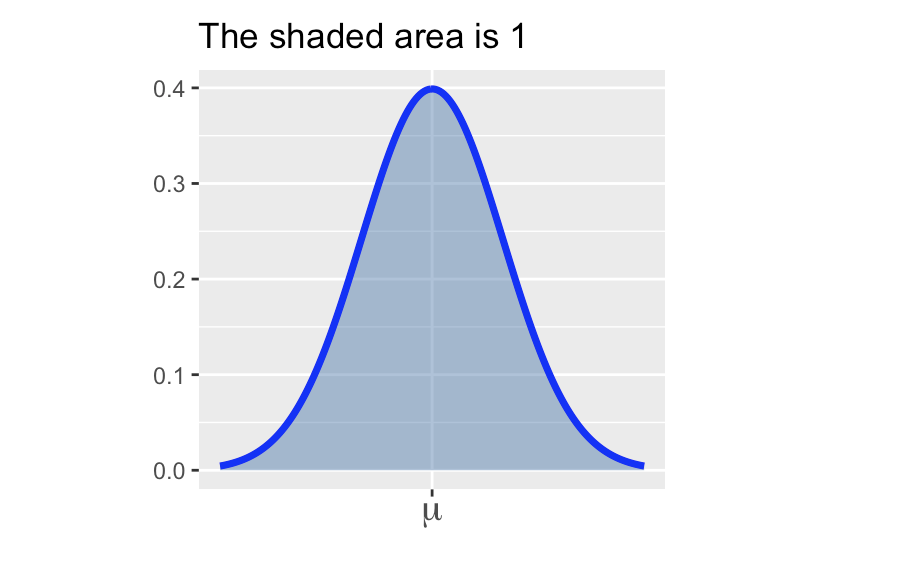
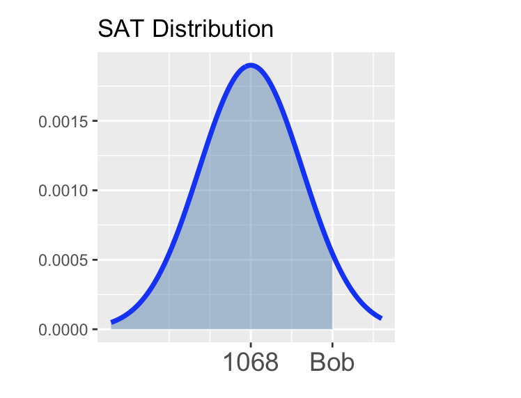
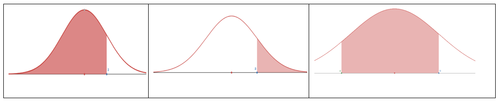
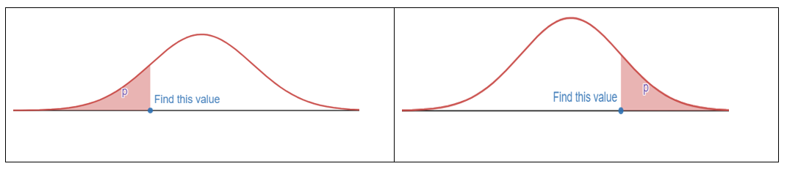

---
output:
  pdf_document: default
  html_document: default
---

# Probability and Probability Distribution

## Probability

### Objectives

By the end of this unit, students will be able to:

::: {.blue-background}
- Explain the concept of randomness and how probability quantifies randomness.
- Recognize the basic concepts of sample space, equally likely outcomes, events, unions and intersections.
- Identify when two events are mutually exclusive, independent or complementary.
- Use probability rules to compute the probability of different types of events.
- Distinguish between marginal probability and conditional probability.
:::


### Overview

The starting point in studying probabilities is the concept of an $\underline{\textbf{experiment or random process}}$, by which we mean some act or observation whose outcome is not known in advance. Simple examples would be

$\bullet\ \  \text{Rolling a die} \\ \\$

$\bullet \ \ \text{Tossing a coin twice} \\ \\$

$\bullet \ \ \text{Observing the temperature at GSO at 3:00 pm this afternoon (Fo)} \\$

Although we cannot predict what we will observe, we can in some cases compile a list of all the outcomes we might observe. This is known as the $\underline{\textbf{sample space}}$ for the experiment, and is a set in mathematical terms, that is to say a collection of distinct items. Generally for a sample space of n possible outcomes we write $S = {E1, E2, ... , E_n}$ . For example in the die rolling experiment we have $\textit{S={1, 2, 3, 4, 5, 6}}$ and in the coin tossing experiment we could list the outcomes as $\textit{S={TT, TH, HT, HH}}$ It is a little harder to list the sample space for the third experiment, given the current temperature a list of the numbers between 40 and 80 would probably suffice.

We use the outcomes in the sample space for computing probabilities for any event according to the following basic rule:

$$
\textbf{P(A) = the sum of the probabilities of all the outcomes in the event A}
$$

**Events** in probability are just the same as sets in mathematics, so you should know the principle operations on sets:

$\bullet$ UNION: A $\cup$ B (“A or B”) is the set of all outcomes in A or in B or in both

$\bullet$ INTERSECTION: A $\cap$ B (“A and B”) is the set of outcomes that are in both A and B

$\bullet\ \ \text{COMPLEMENT: Ac (“not A”) everything outside of A (but in S)}$

{width="726"}

It is important to realize that A $\cup$ B, A $\cap$ B, and $A^c$ are all sets, that is to say, they are **collections of** $\textit{distinct}$ **items, and no element may be listed twice.**

For example, with reference to the die rolling experiment, define the event B as “a number at least as great as 5 comes up”, so B={5,6}. For A={2,4,6} (an even number comes up), we have

$\bullet\ \  \ A \cup B \text{={2,4,5,6},}\\ \\$

$\bullet \ \ \ A\cap B \text{={6},}\\ \\$

$\bullet \ \ A^c \text{={1,3,5}}, \\$

$\bullet \ \ B^c \text{={1,2,3,4}}$

Suppose the die is assumed to be fair. This, by definition, means that each side is equally likely to come up when the die is rolled. If we assign a total probability of 1 to the entire sample space, then we should assign a probability of 1/6 to each of the 6 outcomes in the sample space, so

$$
\text{P(1) = P(2) = P(3) = P(4) = P(5) = P(6) = 1/6.}
$$

Thus, we should obtain:

$P(A) = \frac{1}{6}+\frac{1}{6}+\frac{1}{6}=\frac{3}{6}=\frac{1}{2}$

$P(B) = \frac{1}{6}+\frac{1}{6}=\frac{2}{6}=\frac{1}{3}$

$P(A \cup B) = \frac{1}{6}+\frac{1}{6}+\frac{1}{6}+\frac{1}{6}=\frac{4}{6}=\frac{2}{3}$

$P(A \cap B) = \frac{1}{6}$

$P(A^c) = \frac{1}{6}+\frac{1}{6}+\frac{1}{6}=\frac{1}{2}$

$P(A^c) = \frac{1}{6}+\frac{1}{6}+\frac{1}{6}+\frac{1}{6}=\frac{2}{3}$

Some points worth noting:

$\bullet$ P(A U B) = 4/6 does NOT equal P(A) + P(B) = 5/6 (this is because the two sets have an element, 6, in common).

$\bullet$ P(Ac) = 1 - P(A) and P(Bc) = 1 – P(B).

$\bullet$ Also note that in cases where all the outcomes in the sample space are equally likely, the rule about adding the probabilities for all of the outcomes in the event simplifies to counting the number of outcomes in the event and dividing by the number out outcomes in the sample space. So, for the events A and B above, P(A) = 3/6 = 1⁄2, and P(B) = 2/6 = 1/3.

$\bullet$ Generally, if A contains m outcomes, and the sample space has n equally likely outcomes (so the probability for each outcome is 1/n), then P(A) = m/n.

At this stage, let us write down some **general rules or AXIOMS for probability.** The events A, B below are now general events in a sample space, not the specific ones described above.

1)  For any sample space, P(S) = 1
2)  For any event A, 0 $\le$ P(A) $le$ 1
3)  General addition rule: If A and B are any two events, disjoint or not, then the probability that at least one of them will occur is

$$
\text{P (A or B) = P (A) + P (B) - P (A and B) }
$$

where P(A and B) is the probability that both events occur. Here, A or B occurs means A, B, or both A and B occur.

4)Addition rule for disjoint events: For any events A, B which have no common outcomes,

$$
\text{P(A U B) = P(A) + P(B)}
$$

Events which have no outcomes in common are often referred to as **mutually exclusive** (or $\textit{disjoint}$). If two events A, B are mutually exclusive, we write P(A $\cap$ B) = $\emptyset$ , where $\emptyset$ is referred to as the $\textit{empty set}$. It is sort of equivalent to the number zero in arithmetic.

Note that using the first and third rules, we have $1 = P(S) = P(A \cup A^c) = P(A) + P(A^c)$ ) , so we have a general rule that for any set $A, \ P(A^c) = 1 – P(A)$. This is often called the **law of complements**.

### Solved Problems

**Exercise 1.** A set of 11 cards is numbered 1 through 11. A card is picked at random and the following events defined: A - the number on card is odd: B - the number on the card is 5 or higher. Find

a)  P(A) =

b)  P(B) =

c)  P(A and B) =

d)  P(A or B) =

**Exercise 2.** (Sample space where the outcomes are NOT equally likely): Professor Donald Fraser of the University of Toronto constructed a (purposely) uneven die. On inspection it was clear that the sides would not have equal probability. He rolled it 12,800 times, and came up with the following empirical probabilities (based on relative frequency):

| Side        | 1     | 2     | 3     | 4     | 5     | 6     |
|-------------|-------|-------|-------|-------|-------|-------|
| Probability | 0.186 | 0.179 | 0.207 | 0.137 | 0.149 | 0.142 |

For the events A (even number) and B (at least 5) compute:

a)  $\text{P(A) =}$

b)  $\text{P(B) =}$

c)  $P(A \cup B)=$

d)  $P(A\cap B) =$

e)  $P(A^c) =$

f)  $P(B^c) =$

**Exercise 3.** A group of 1000 students is classified by gender $G_1$ (male) or $G_2$ (female), and by year, $\textbf{Y}_1$ (freshman), $\textbf{Y}_2$ (sophomore), $\textbf{Y}_3$ (junior), or $\textbf{Y}_4$ (senior). This results in the following table:

|                | Freshman ($Y_1$) | Sophomore ($Y_2$) | Junior ($Y_3$) | Senior ($Y_4$) | Total |
|------------|------------|------------|------------|------------|------------|
| Male ($G_1$)   | 140              | 120               | 110            | 70             | 440   |
| Female ($G_2$) | 160              | 130               | 140            | 130            | 560   |
| Total          | 300              | 250               | 250            | 200            | 1000  |

If a student is randomly selected, find the probability that the student:

a)  Is a junior, P($Y_3$) =

b)  Is a female freshman, P($G_2$ and $Y_1$) =

c)  Is a male or a junior, P($G_1$ or $Y_3$) =

d)Is not a freshman, P(not $Y_1$) =

e)  Is not a male and is not a junior, P(not $G_1$ and not $Y_3$) =

**Exercise 4.** Here is the “Craps Game” sample space, where a red and a green die are rolled. Each outcome (i,j) represents the red die coming up i and the green die coming up j.

|         | j=1   | j=2   | j=3   | j=4   | j=5   | j=6   |
|---------|-------|-------|-------|-------|-------|-------|
| **i=1** | (1,1) | (1,2) | (1,3) | (1,4) | (1,5) | (1,6) |
| **i=2** | (2,1) | (2,2) | (2,3) | (2,4) | (2,5) | (2,6) |
| **i=3** | (3,1) | (3,2) | (3,3) | (3,4) | (3,5) | (3,6) |
| **i=4** | (4,1) | (4,2) | (4,3) | (4,4) | (4,5) | (4,6) |
| **i=5** | (5,1) | (5,2) | (5,3) | (5,4) | (5,5) | (5,6) |
| **i=6** | (6,1) | (6,2) | (6,3) | (6,4) | (6,5) | (6,6) |

There are n=36 outcomes, and for fair dice it is reasonable to assume they are equally likely.**Find the probability of each of the following events. Identify which pairs of events are disjoint.**

(a) A “sum is 7”:

    P(A) =

(b) B “sum is 11”:

    P(B) =

(c) C “sum is 6”:

    P(C) =

(d) D “both dice show same number”:

    P(D) =

(e) E “both dice odd”:

    P(E) =

(f) F “both dice even”:

    P(F) =

**Exercise 5. True or False**

a)  If A and B are mutually exclusive (disjoint) events, then P(A and B) = 0.

b)  For any event A, P(A) + P($A^c$) = 1.


Question 1:

Since, A = {1,3,5,7,9,11}, B= {5,6,7,8,9,10,11}, (A and B) = {5,7,9,11} and (A or B)={1,3,5,6,7,8,9,10,11}

a)  $\text{P(A)}=\frac{6}{11}$

b)  $\text{P(B)}=\frac{7}{11}$

c)  $\text{P(A and B)}=\frac{4}{11}$

d)  $\text{P(A or B)=P(A)+P(B)-P(A and B)}\\=\frac{6}{11}+\frac{7}{11}-\frac{4}{11}=\frac{9}{11}$

Question 2:

A = {2,4,6}, B= {5,6}, (A$\cup$B) = {2,4,5,6} and (A $\cap$ B)={6}

a)  $\text{P(A)=P(2)+P(4)+P(6)=}0.179+0.137+0.142=0.458$

b)  $\text{P(B)=P(5)+P(6)}=0.149+0.142=0.291$

c)  $\text{P(A U B)}=\text{P(2)+P(4)+P(5)+P(6)}=0.179+0.137+0.149+0.142 \\=0.607$

d)  P(A$\cap$B)=P(6)=0.142

e)  P($A^c$)= 1 - P(A) = 1 - 0.458 = 0.542

f)  P($B^c$)= 1 - P(B) = 1 - 0.291 = 0.709

Question 3:

The probability that the student :

a)  Is a junior, P($Y_3$) = $\frac{250}{1000}=0.25$

b)  Is a female freshman, P($G_2$ and $Y_1$)= $\frac{160}{1000}=0.16$

c)  Is a male or a junior, P($G_1$ or $Y_3$)= $\frac{440+140}{1000}=\frac{580}{1000}=0.580$

    or P($G_1$)+ P($Y_3$) - P($G_1$ and $Y_3$) = $\frac{440}{1000}+\frac{250}{1000}-\frac{110}{1000}$

d)  Is not a freshman, P(not $Y_1$)= 1 - P($Y_1$) = 1 - ($\frac{300}{1000}$) =1 - 0.3 = 0.70

e)  Is not a male and is not a junior, P (not $G_1$ and not $Y_3$) = $\frac{150+130+130}{1000}$ = $\frac{420}{1000}=0.420$

Question 4:

<h5>Note: For this question, also ask them to identify which pair of event are disjoint.</h5>

a)  A "sum is 7" : {(1,6),(6,1), (2,5), (5,2), (3,4), (4,3)}

P(A) = $\frac{6}{36}=\frac{1}{6}$

b)  B "sum is 11": {(5,6),(6,5)}

P(A) = $\frac{2}{36}=\frac{1}{18}$

c)  C "sum is 6": {(1,5), (5,1), (2,4), (4,2), (3,3)}

P(C) = $\frac{5}{36}$

d)  D "both dice show small number": {(1,1), (2,2), (3,3), (4,4), (5,5),(6,6)}

P(D) = $\frac{6}{36}=\frac{1}{6}$

e)  E "both dice odd": {(1,1), (1,3), (1,5), (3,1), (3,3),(3,5),(5,1),(5,3),(5,5)}

P(E) = $\frac{9}{36}=\frac{1}{4}$

f)  F "both dice even": {(2,2), (2,4), (2,6), (4,2), (4,4),(4,6),(6,2),(6,4),(6,6)}

P(F) = $\frac{9}{36}=\frac{1}{4}$

Question 5:

a)  If A and B are mutually exclusive (disjoint) events, then P(A and B) = 0.

    Ans : TRUE

    {width="228"}

b)  For any event A, P(A) + P($A^c$) = 1.

    Ans : TRUE

    {width="294"}

### Exercises


## Discrete Random Variables

### Objectives

By the end of this unit, students will be able to:

::: {.blue-background}
- Use probability rules to compute the probability of different types of events.
- Distinguish between marginal probability and conditional probability.
- Apply the multiplication rule to compute probabilities when sampling with/without replacement from finite populations.
- Define random variables.
- Compute expectation and variance of discrete random variables.
:::

### Overview
   

### Solved Problems

1.  What is the probability that exactly five of them support the proposition?
     
Using the binomial probability formula:
   $$
   P(X = k) = \binom{n}{k} p^k (1-p)^{n-k}
   $$
   where $n = 10$, $k = 5$, and $p = 0.4$.
   

2.  What is the probability that five or six of them support the proposition?

3.  What is the probability that at least three of them support the proposition?

**Exercise:** the manufacturer of the ColorSmart-5000 television set claims that 95% of 
its sets last at least five years without requiring a single repair. Suppose that we contact 8 randomly selected ColorSmart-5000 purchasers five years after they purchased their sets 
and ask each purchaser: Have you needed any repair for your ColorSmart-5000 TV set 
during the first 5 years after purchasing the set?

1. Find the probability that exactly 7 customers needed at least one repair during the first 5 years.

2. Find the probability that at least 7 purchasers needed at least one repair during the first 5 years.

**Solution**

Exercise: Profit from crop yield under different weather condi-tions (X).
1. Determine the missing probability in the following distribution.


| **Weather**  | **Profit ($)** | **Probability** |
|--------------|----------------|-----------------|
| Dry          | 200,000        | 0.30            |
| Light Rain   | 300,000        | 0.50            |
| Storm        | 150,000        | ?               |


2. Find the expected profit from this crop, $\mu$.

$$
\begin{aligned}
\mu &= \sum{x_i}P(x_i) \\
    &= \$200k \cdot 0.3 + \$300k \cdot 0.5 + \$150k \cdot 0.2 \\
    &= \$60k + \$150k + \$30k = \$240k
\end{aligned}
$$


3. Find the variance, $\sigma^2$ and the standard deviation, $\sigma$.

$$
\begin{aligned}
\sigma^2 &= \sum(x_i-\mu)^2P(x_i) \\
&= (\$200k-\$240k)^2 \ . 0.3 + (\$300k-\$240k)^2 \ . 0.5 + (\$150k-\$240)^2 . 0.2 \\
&= \$^2 3,900, 000, 000 \\
\end{aligned}
$$

The standard deviation is $\sigma = \sqrt{\$^2 3,900,000,000}$ = $62,450

4. Interpret the value of the expected profit, $\mu$.

The expected profit represents the long-run average, the expected profit on average in the future.

**Example/Exercise: 40% of all voters support Proposition A. If a random sample of 10 voters is polled. Find the following probabilities.**


1.  What is the probability that exactly five of them support the proposition?

$$
\begin{aligned}
P(X=5)&=\frac{10!}{(10-5)!5!}(0.40)^5(0.60)^{10-5} \\
&=\frac{10!}{5!5!}(0.40)^5(0.60)^5 \\
&=(252)(0.01024)(0.07776) \\
&=0.2007
\end{aligned}
$$

2.  What is the probability that five or six of them support the proposition?

$$
\begin{aligned}
P(X=5)+P(X=6)&=0.2007+\frac{10!}{(10-6)!6!}(0.40)^6(0.60)^{10-6} \\
&=0.2007+\frac{10!}{4!6!}(0.40)^6(0.60)^4 \\
&=0.2007+(210)(0.004096)(0.1296) \\
&=0.2007+0.1115 \\
&=0.312
\end{aligned}
$$


3. What is the probability that at least three of them support the proposition?

$$
\begin{aligned}
P(x \ge 3) &= P(X=3)+P(X=4)+P(X=5)+P(X=6)+...+P(X=10) \\
&=1-[P(X=0)+P(X=1)+P(X=2)] \\
&=1-[\frac{10!}{0!10!}(0.40)^0(0.60)^{10}+\frac{10!}{1!9!}(0.40)^1(0.60)^9+\frac{10!}{2!8!}(0.40)^2(0.60)^8] \\
&=1-[(1)(1)(0.0060)+(10)(0.40)(0.0101)+(45)(0.16)(0.0168)] \\
&=1-[0.0060+0.0403+0.1209] \\
&=1-0.1672 = 0.8328
\end{aligned}
$$

**Exercise:** the manufacturer of the ColorSmart-5000 television set claims that 95% of 
its sets last at least five years without requiring a single repair. Suppose that we contact 8 randomly selected ColorSmart-5000 purchasers five years after they purchased their sets and ask each purchaser: Have you needed any repair for your ColorSmart-5000 TV set during the first 5 years after purchasing the set?


1. Find the probability that exactly 7 customers needed at least one repair during the first 5years.

$$
\begin{aligned}
P(X=7)&=\frac{8!}{(8-7)!7!}(0.05)^7(0.95)^{8-7} \\
&=\frac{8!}{1!7!}(0.05)^7(0.95)^1 \\
&=0.0000000059375
\end{aligned}
$$

2. Find the probability that at least 7 purchasers needed at least one repair during the first 5years.

$$
\begin{aligned}
P(X=7)&=P(X=7)+P(X=8)\\
&=0.0000000059375+\frac{8!}{(8-8)!8!}(0.05)^8(0.95)^{8-8} \\
&=0.0000000059375+0.0000000000390625 \\
&=0.0000000059765625
\end{aligned}
$$

### Exercises

**Exercise: Profit from crop yield under different weather conditions (X).**


1. Determine the missing probability in the following distribution.


| Weather      | Profit (\$) | Probability |
|--------------|-------------|-------------|
| Dry          | 200,000     | 0.30        |
| Light Rain   | 300,000     | 0.50        |
| Storm        | 150,000     | ?           |


2. Find the expected profit from this crop, $\mu$.


| $x_i$    | $P(x_i)$ | $x_i P(x_i)$            |
|----------|----------|-------------------------|
| 200,000  | 0.30     | $200,000 \times 0.30$   |
| 300,000  | 0.50     | $300,000 \times 0.50$   |
| 150,000  | ?        | $150,000 \times ?$      |


3. Find the variance, $\sigma^2$ and the standard deviation, $\sigma$.


| $x_i$   | $P(x_i)$ | $\mu$ | $(x_i - \mu)$ | $(x_i - \mu)^2$ | $(x_i - \mu)^2 P(x_i)$ |
|---------|----------|-------|---------------|-----------------|------------------------|
| 200,000 | 0.30     |       |               |                 |                        |
| 300,000 | 0.50     |       |               |                 |                        |
| 150,000 | ?        |       |               |                 |                        |
    
   
   The standard deviation is $\sigma$ = ________________
   
   
4.  Interpret the value of the expected profit, $\mu$.

**Example/Exercise: 40% of all voters support Proposition A. If a random sample of 10 voters is polled. Find the following probabilities.**

**Formula for the probability of exactly $x$ successes from $n$ trials**

$$
p(x) = \binom{n}{x} p^x q^{n-x} = \frac{n!}{(n-x)!x!} p^x q^{n-x}; \quad \text{where } x = 0, 1, 2, \ldots, n
$$

and

$$
n! = n(n-1)(n-2) \cdots (3)(2)(1)
$$

## Binomial Distribution

### Objectives

By the end of this unit, students will be able to:

::: {.blue-background}
- Identify when the conditions apply for the Binomial distribution to be used.
- Apply the Binomial distribution to model counts resulting from binary trials.
:::

### Overview 

**Binomial Distribution Condition**

Conditions to be satisfied for a Binomial Variable Distribution with a fixed number of trials $n$:

-   The trials are independent
-   Each trial has two possible outcomes classified as success or failure
-   The probability of a success $p$ is the same for each trial

**Probability Mean and Standard Deviation**

For a binomial random variable $X$ with $n$ trials and the probability of a single trial being a success $p$, the probability of observing exactly $k$ successes is

$$
P(X = k) = \binom{n}{k} p^k (1-p)^{n-k} = \frac{n!}{k!(n-k)!} p^k (1-p)^{n-k} \quad (k = 0, 1, \ldots, n)
$$

Where: - $n! = 1 \times 2 \times \cdots \times n$ - $0! = 1$ - $\binom{n}{k} = \frac{n!}{k!(n-k)!}$ (read as “n choose k”, also called the combination coefficient)

The probability of <u>at most</u> $k$ successes is given by
$$\displaystyle{\mathbb{P}\left[X \leq k\right] = \sum_{i=0}^{k}{\binom{n}{i}\cdot p^i\left(1 - p\right)^{n-i}} \approx \tt{pbinom(k, n, p)}}$$

In the equations above, $\binom{n}{k} = \frac{n!}{k!\left(n-k\right)!}$ counts the number of ways to arrange the $k$ successes amongst the $n$ trials. That being said, the `R` functionality, `dbinom()` and `pbinom()` allow us to bypass the messy formulas -- but you'll still need to know what these functions do in order to use them correctly!

**Tip:** We need to use the binomial distribution to find probabilities associated with numbers of successful (or failing) outcomes in which *we do not know for certain the trials on which the successes (or failures) occur*


Mean: $\mu = np$

Standard deviation: $\sigma = \sqrt{np(1-p)}$

Observations that are more than 2 standard deviations away from the mean are considered unusual:

Unusual if outside of $\mu - 2\sigma$ and $\mu + 2\sigma$

**Shape of Binomial Distribution**

-   For $p < 0.5$: skew to the left
-   For $p > 0.5$: skew to the right
-   For $p = 0.5$: symmetric (centered at $\mu$)
-   For large $n$, if $np \geq 10$ and $n(1-p) \geq 10$, the graph is approximately bell-shaped.

{width="550"}

(Generated using online app <https://istats.shinyapps.io/BinomialDist/>)

**Using R**

-   For $P(X = k)$: `dbinom(k, n, p)`

-   For $P(X \leq k) = P(X < k+1) = P(X = 0) + P(X = 1) + \cdots + P(X = k)$: `pbinom(k, n, p, lower.tail = TRUE)` (the `lower.tail = TRUE` can be omitted)

-   For $P(X > k) = P(X \geq k+1) = 1 - P(X \leq k) = P(X = k+1) + \cdots + P(X = n)$: `pbinom(k, n, p, lower.tail = FALSE)`

-   For $n!$: `factorial(n)`

-   For $\binom{n}{k}$: `choose(n, k)`

**Using Calculator**

1.  For $P(X = x)$:
    -   `2ND` → `VARS` (`DISTR`) → use arrow to select `binompdf` (enter $n$, $p$, $x$) then `enter`
2.  For $P(X \leq x)$:
    -   `2ND` → `VARS` (`DISTR`) → use arrow to select `binomcdf` (enter $n$, $p$, $x$) then `enter`
3.  For $n!$:
    -   Example: $7!$
    -   Enter 7 then press `Math` key; use (right) arrow key to select `PROB` then use (down) arrow key to select `!` (press enter it then shows `7!`); press the `enter` key again (to get answer 5040)
4.  For $\binom{n}{k}$:
    -   Example: $\binom{9}{2}$
    -   Enter 9 then `MATH` → arrow to `PROB` → choose `nCr` then enter 2 then `enter` to get the result (answer is 36)

### Solved Problem

### Exercises

**Exercise 1**. How many ways can we choose 2 students from a group of 6?

**Exercise 2** (Combination Formula)

Survey four randomly selected students and record the outcomes as “I” (in state) or “O” (out state). Fill the table below.

| \# of “I” | Outcomes (list all) | \# of outcomes | $\binom{4}{k} = \frac{4!}{k!(4-k)!}$ |
|---------------|---------------|---------------|----------------------------|
| $k = 0$   |                     |                |                                      |
| $k = 1$   |                     |                |                                      |
| $k = 2$   |                     |                |                                      |
| $k = 3$   |                     |                |                                      |
| $k = 4$   |                     |                |                                      |

**Exercise 3** Find the probability of success of the Bernoulli trial with $n$ trials, success probability $p$, and the success $k$:

-   $n = 3$, $k = 2$, $p = 0.35$
-   $n = 5$, $k = 3$, $p = 0.2$

**Exercise 4**

For a binomial distribution with $n = 4$, $p = 0.7$. (As in exercise 1, assume that 70% are in-state students.)

(a). Write the formula for computing the probability of getting exactly $k$ successes.

(b). Fill the following distribution table. (Round to 4 decimals) (you may use R calculator)

| $X$   | $P(X = k)$ | $P(X \leq k)$ |
|-------|------------|---------------|
| 0     |            |               |
| 1     |            |               |
| 2     |            |               |
| 3     |            |               |
| 4     |            | 1             |
| Total | 1          |               |

(c). What is the expected value?\
(d). What is the standard deviation?

**Exercise 5**

About 75% of dog owners buy holiday presents for their dogs. Suppose twenty dog owners are randomly selected, find the probability of:

(a). Exactly three buy their dog holiday presents

(b). Exactly seventeen do not buy their dog holiday presents

(c). Three or more buy their dog holiday presents

(d). At most four buy their dog holiday presents

(e). Minimum of 11 and maximum of 17 dog owners buy their dog holiday presents

(f). Find the expected number of dog owners in this sample, who buy their dog holiday presents.

(g). Is it unusual if 16 out of 20 randomly selected dog owners buy their dog holiday presents? Why?

(h). Is it unusual if 10 out of 20 randomly selected dog owners buy their dog holiday presents? Why?

$\underline{\textbf{Review on Binomial Distribution}}$

**Conditions**to be satisfied for a Binomial Variable Distribution:

$\bullet \ \ \text{The number of trials,is a fixed positive integer}$

$\bullet \ \ \text{The trials are independent}$

$\bullet \ \ \text{Each trail has two possible outcomes, classified as success or failure}$

$\bullet \ \ \text{The probability of a success, p, is the same for each trial}$

<p id="a">

Binomial Distribution

</p>

For a binomial random variable with trials and the probability of a single trial being a success the probability of observing exactly successes is

<p id="binom">

$P(X =k) = \binom nkp^k(1-p)^{n-k}=\frac{n!}{k! (n-k)!}p^k(1-p)^{n-k} \text{  k= 0,1, ..., n}$

</p>

<p id="a">

Accumulative Probability

</p>

(at most k success) $P(X\le k)=P(X <k+1)=\sum_{i=0}^{k}P(X=i)$

(at least k success) $P(X\ge k)=P(X>k-1)=1-P(X\le k-1)=\sum_{i=k}^n P(X=i)$

<p id="a">

$\underline{\textbf{Factorial and Combination Coefficient}}$

</p>

n! = $1 \times 2 \times ... \times n$ 0! = 1

$\binom nk = \frac{n!}{k!(n-k)!}$ ($\binom nk$ is read as “n choose k”)


**Solution:**

**Exercise 1. How many ways can we choose 2 students from a group of 6?**

```{r}
choose(6,2)
```

**Exercise 4.** For a binomial distribution with n=4,p=0.2.

**a) Write the formula for computing the probability of getting exactly k successes.**

$P(X =k) = \binom nkp^k(1-p)^{n-k}=\frac{n!}{k! (n-k)!}p^k(1-p)^{n-k} \text{  k= 0,1, ..., n}$

In R you use dbinom(k,n,p)

**b) Fill the following distribution table. (Round to 4 decimals) (you may use R calculator)**

```{r}
## For P(X=x)
dbinom(c(0,1,2,3,4), 4, 0.2)

```

```{r}
## P(X <= x)
pbinom(c(0,1,2,3,4), 4, 0.2)
```

**c) What is the expected value?**

```{r}
n=4;p=0.2
Expected_mean <-n*p ; Expected_mean
```

**d) What is the standard deviation?**

```{r}
n=4
p=0.2
sd <- sqrt(n*p*(1-p)); sd
```

**Exercise 5. About 75% of dog owners buy holiday presents for their dogs. Suppose twenty dog owners are randomly selected, find the probability of a) Exactly three buy their dog holiday presents**

$$P(X=3)$$

```{r}
dbinom(3,20,0.75)
```

**b) Exactly seventeen do not buy their dog holiday presents**

$$P(X=17)$$

```{r}
dbinom(17,20,0.25)
```

**c) Three or more buy their dog holiday presents**

$$P(X\ge 3)=1-P(X \le 3)$$

```{r}
1 - pbinom(3,20,0.75)

## or
pbinom(3,20,0.75, lower.tail=FALSE)
```

**d) At most four buy their dog holiday presents**

$$P(X\ge 4)=P(X = 0)+...+P(X=4)$$

```{r}
pbinom(4,20,0.75)

## or

sum(dbinom(c(0,1,2,3,4),20,0.75))

```

**e) Minimum of 11 and maximum of 17 dog owners buy their dog holiday presents**

$$P(11 \le X \le 17)$$

```{r}
pbinom(17,20,0.75)-pbinom(10,20,0.75)

```

**f) Find the expected number of dog owners in this sample, who buy their dog holiday presents**

```{r}
n=20; p=0.75
E_x = n*p ; 
E_x
```

**g) Is it unusual if 16 out of 20 randomly selected dog owners buy their dog holiday presents? Why?**

```{r}
dbinom(16,20,0.75)
```

<p id="binom">

**Comment**

<p>

Whether it’s unusual depends on your chosen significance level. If you consider a low probability (e.g., p\<0.05) as unusual, then it might be considered unusual.

**Is it unusual if 10 out of 20 randomly selected dog owners buy their dog holiday presents? Why?**

```{r}
dbinom(10,20,0.75)
```

<p id="binom">

**Comment**

<p>

Whether it’s unusual depends on your chosen significance level. If you consider a low probability as unusual, then it might be considered unusual.


## Normal Distribution

### Objectives

By the end of this unit, students will be able to:


::: {.blue-background}
- Understand the notion and characteristics of continuous probability distributions.
- Use the normal distribution to model continuous random variables.
:::

### Overview
**The Normal Distribution**

**Definition:** If a random variable $X$ is normally distributed with mean $\mu$ and standard deviation $\sigma$, we often write $X\sim N\left(\mu, \sigma\right)$. Three different normal distributions appear below.

+ In **<span style = "color:blue">blue</span>** is a normal distribution with $\mu = 0$ and $\sigma = 5$
+ In **<span style = "color:red">red</span>** is a normal distribution with $\mu = 0$ and $\sigma = 0.5$
+ In **black** is a normal distribution with $\mu = 0$ and $\sigma = 1$ (the so-called *Standard Normal Distribution*)

{width="600"}

**Properties of the Normal Distribution:** We have the following properties associated with the normal distribution. Consider $X\sim N\left(\mu, \sigma\right)$.

The area beneath the entire distribution is 1 (since this is equivalent to the probability that $X$ takes on any of its possible values).


{width="600"}

$\displaystyle{\mathbb{P}\left[X\leq \mu\right] = \mathbb{P}\left[X\geq \mu\right] = 0.5}$ (the area underneath a full half of the distribution is 0.5)

{width="600"}

The distribution is symmetric. In symbols, $\mathbb{P}\left[X\leq \mu - k\right] = \mathbb{P}\left[X \geq \mu + k\right]$ for any $k$.

{width="600"}

$\displaystyle{\mathbb{P}\left[X = k\right] = 0}$ (the probability that $X$ takes on any prescribed value exactly is $0$)

{width="600"}
Sometimes it is useful to be able to estimate probabilities or to estimate the proportion of a population that falls into a range as long as the population is nearly normal. A convenient rule of thumb is the *Empirical Rule*.

**The Empirical Rule:** If $X\sim N\left(\mu, \sigma\right)$, then

$\mathbb{P}\left[\mu - \sigma \leq X\leq \mu + \sigma\right] \approx 0.68$ -- that is, about 68% of observations lie within one standard deviation of the mean.

$\mathbb{P}\left[\mu - 2\sigma \leq X\leq \mu + 2\sigma\right] \approx 0.95$ -- that is, about 95% of observations lie within two standard deviations of the mean.

$\mathbb{P}\left[\mu - 3\sigma \leq X\leq \mu + 3\sigma\right] \approx 0.997$ -- that is, about 99.7% of observations lie within three standard deviations of the mean.

**Standardization and $z$-scores**

**Scenario:** Two students, Bob and Sally, are trying to compare how well they did on a college entrance exam. The difficulty comes in that Bob took the SAT which is known to follow an approximate normal distribution with a mean score of 1068 and a standard deviation of 210 while Sally took the ACT which also follows an approximately normal distribution but with a mean score of 20.8 and a standard deviation of 5.8. If Bob scored a 1400 on the SAT and Sally scored a 31 on the ACT, who scored relatively higher?

How do we answer this question? We'll see two methods.


**Method 1:** We can standardize the test scores so that they have comparable units. 

- **Definition:** If an observation $x$ comes from a nearly normal population with mean $\mu$ and standard deviation $\sigma$ then we compute $z$-score associated with $x$ as follows: 

$$\displaystyle{z = \frac{x - \mu}{\sigma}}$$

- An observation's $z$-score is simply the number of standard deviations it falls above or below the mean. 


**A recap on $z$-scores:** We can use $z$-scores as a common unit for comparing observations from completely different populations (such as SAT scores and ACT scores). Here's a recap of the most important information so far:

If an observation $x$ comes from a nearly normal population with mean $\mu$ and standard deviation $\sigma$, we can compute it's $z$-score using the formula: $\displaystyle{z = \frac{x - \mu}{\sigma}}$.

A $z$-score measures the number of standard deviations which an observation falls above or below the mean.


- A positive $z$-score means that an observation was above the mean.
- A negative $z$-score means that an observation was below the mean.
- The larger a $z$-score is in absolute value, the further the corresponding observation falls from the mean. That is, the larger the magnitude of a $z$-score, the further into the tail of the distribution the corresponding observation falls.

**Method 2:** We can compute the *percentile* corresponding to Bob's SAT score and the *percentile* corresponding to Sally's ACT score.
  
- **Definition:** Given an observation $x$ from a population -- the *percentile* corresponding to $x$ is the percentage (proportion $\times$ 100) of the population which falls below $x$.


Bob's percentile corresponds to the shaded area in the distribution below.


{width="600"}

Sally's percentile corresponds to the shaded area in the distribution below.

{width="600"}

There are many ways to compute percentiles. Before the widespread availability of statistical software, people converted observed values to $z$-scores and then looked up the percentile in a table. Luckily R provides nice functionality for computing percentiles.

**Computing Percentiles in R:** If $X\sim N\left(\mu, \sigma\right)$, then 
$$\mathbb{P}\left[X\leq q\right] \approx \tt{pnorm(q, mean = \mu, sd = \sigma)}$$

**Computing probability from a normal distribution**

Through this section you'll be getting practice finding probabilities by using R's `pnorm()` function to compute areas. Remember that the `pnorm()` function takes three arguments -- the first is a $\tt{boundary}$ value, the second is the $\tt{mean}$ of the distribution, and the third is the $\tt{standard~deviation}$. The value returned by `pnorm()` is the area to the <u>left</u> of the provided boundary value in the distribution with the mean and standard deviation you provided.

For these first few questions I'll draw pictures for you, but you should be prepared to draw your own shortly.

**Question 1:** Remember that $Z\sim N\left(\mu = 0, \sigma = 1\right)$.

{width="600"}

**Question 2:** Find $\mathbb{P}\left[Z > \right.$  $\left.\right]$.

{width="600"}

**Question 3:** Find $\mathbb{P}\left[\right.$  $< Z <$  $\left.\right]$.

{width="600"}

Through the last three problems you only worked with the standard normal distribution -- that's the $Z$-distribution, which is $N\left(\mu = 0, \sigma = 1\right)$. We can find probabilities from arbitrary normal distributions (normal distributions with any mean and any standard deviation) using R's 'pnorm()' functionality -- just supply the appropriate 'mean' and 'sd' arguments to 'pnorm()' instead of the 0 and 1 that we passed earlier.

**Finding percentile cutoffs on a normal distribution**


Recall from earlier that the $p^{th}$ percentile of a random variable $X$ is the value $x^*$ such that $\mathbb{P}\left[X < x^*\right] = p$.

{width="600"}

If $X\sim N\left(\mu, \sigma\right)$, then to find the cutoff $x^*$ for which $\mathbb{P}\left[X < x^*\right] = p$, we can use R's 'qnorm()' function. Similar to `pnorm()`, this function takes three arguments. The first is the $\tt{area~to~the~\underline{LEFT}}$ of the desired cutoff, the second is the $\tt{mean}$ of the distribution, and the third is the $\tt{standard~deviation}$ of the distribution.

Recall from earlier that SAT scores followed $N\left(\mu = 1068, \sigma = 210\right)$ and ACT scores followed $N\left(\mu = 20.8, \sigma = 5.8\right)$. The code block below is set up to find the minimum required SAT score to fall in the 95th percentile (to do better than 95% of other test-takers). Execute the code and note the required score. Adapt the code to find the minimum ACT score required to fall into the top 10% of all ACT test takers. Does your answer seem right? How can you judge?


**Using R to compute cumulative probability for $X \sim N(\mu, \sigma)$**

-   For $P(X < b) = P(X \leq b)$: `pnorm(b, \mu, \sigma)`
-   For $P(X > a) = P(X \geq a)$: `pnorm(a, \mu, \sigma, lower.tail = FALSE)` or `1 - pnorm(a, \mu, \sigma)`
-   For $P(a < X < b)$: `pnorm(b, \mu, \sigma) - pnorm(a, \mu, \sigma)` or `1 - (pnorm(a, \mu, \sigma) + pnorm(b, \mu, \sigma, lower.tail = FALSE))`
-   For $Z \sim N(0, 1)$: the mean and SD can be omitted in 1)-3):
    -   $P(Z < b)$: `pnorm(b)`

{width="550"}

**To Compute Inverse Cumulative Probability (Finding x for Given Cumulative Probability)**

-   Find $x$ for $P(X < x) = p$: `qnorm(p, \mu, \sigma)`
-   Find $x$ for $P(X > x) = p$: `qnorm(1 - p, \mu, \sigma)` or `qnorm(p, \mu, \sigma, lower.tail = FALSE)`

{width="550"}

**Z-score**

-   If $X \sim N(\mu, \sigma)$, the z-score of x is computed by $z = \frac{x - \mu}{\sigma}$.
-   The z-score measures how many standard deviations of x from the mean.
-   $Z = \frac{X - \mu}{\sigma} \sim N(0, 1)$
-   $X = \mu + Z \cdot \sigma$
-   $x = \mu$ if $z = 0$; $x > \mu$ if $z > 0$; $x < \mu$ if $z < 0$

**Empirical Rule (68-95-99.7 Rule)**

For a nearly normally distributed data, the empirical rule predicts that:

-   68% of observations fall within the first standard deviation ($\mu$ ± $\sigma$).
-   95% within the first two standard deviations ($\mu$ ± 2$\sigma$).
-   99.7% within the first three standard deviations ($\mu$ ± 3$\sigma$) of the mean.

{width="408"}

### Solved Problem

### Exercises

**Exercise 1** For $Z \sim N(0, 1)$ (the standard normal distribution, the mean = 0, the standard deviation = 1), use R to find the probability and sketch the region that represents the probability.

(a). $P(Z < -1.5)$ (b). $P(Z > 1.75)$ (c). $P(-1.5 < Z < 1.75)$ (d). $P(|Z| < 2.5)$ (e). $P(Z > 1)$

**Exercise 2** For $X \sim N(-3, 2)$ (the normal distribution, the mean = -3, the standard deviation = 2), use R to find the probability and sketch the region that represents the probability.

1.  $P(X < -3.25)$
2.  $P(X > 1.75)$
3.  $P(-3.25 < X < -1.25)$

**Exercise 3** For $X \sim N(-3, 2)$, compute the z-score of the given x:

1.  $x = -3.25$
2.  $x = -3$
3.  $x = -1.25$

**Exercise 4**

(a). State the Empirical Rule.

(b). Use R to verify the Empirical Rule: find $P(|Z| < 1)$, $P(|Z| < 2)$, $P(|Z| < 3)$.

**Exercise 5**

The scores on a college entrance exam follow a normal distribution with a mean of 50 and standard deviation of 10. Find the probability that a student will score:

(a). Over 65

(b). Less than 25

(c). Between 33 and 68

**Exercise 6**

The scores on a college entrance exam follow a normal distribution with a mean of 50 and standard deviation of 10.

(a). What is the cut off score of the lowest 20%? (Round to 1 decimal)

(b). What is the cut off score of the highest 10%? (Round to 1 decimal)

**Exercise 7**

The hours of sleep of college students fits a normal distribution with mean of 7.2 hours and standard deviation of 1.3 hours. Find the (standardized) z-score corresponding to 6.5 hours.

**Exercise 8**

John scored a 92 on a test with a mean of 88 and a standard deviation of 2.7. Jessica scored an 86 on a test with a mean of 82 and a standard deviation of 1.8. Find the Z-scores for John's and Jessica's test scores and use them to determine who did better on their test relativ\*e to their class.

**Exercise 9**

The score data of the verbal portion of the Graduate Record Examination (GRE) is approximately normally distributed with a mean of 462 points and a standard deviation of 119 points. Fill in the following blanks: approximately

*(a)* 68% of students who took the verbal portion of the GRE scored between \_\_\_\_\_\_\_ and \_\_\_\_\_\_\_\_

*(b)* 95% of students who took the verbal portion of the GRE scored between \_\_\_\_\_\_ and \_\_\_\_\_\_\_\_

*(c)* 99.7% of students who took the verbal portion of the GRE scored between \_\_\_\_\_\_ and \_\_\_\_\_\_\_\_


