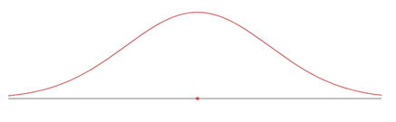

---
output:
  html_document: default
  pdf_document: default
---

# Normal Distribution Worksheet

## Review on Normal Distribution

**Normal Distribution Facts**

-   It is a continuous random variable distribution over $(-\infty, \infty)$.
-   Its probability density curve is symmetric bell-shaped (unimodal).
-   It is completely determined by the mean $\mu$ and standard deviation $\sigma$, denoted by $N(\mu, \sigma)$.
-   $N(0, 1)$ is called the standard normal distribution.

{width="323"}

Using R to compute cumulative probability for $X \sim N(\mu, \sigma)$

-   For $P(X < b) = P(X \leq b)$: `pnorm(b, \mu, \sigma)`
-   For $P(X > a) = P(X \geq a)$: `pnorm(a, \mu, \sigma, lower.tail = FALSE)` or `1 - pnorm(a, \mu, \sigma)`
-   For $P(a < X < b)$: `pnorm(b, \mu, \sigma) - pnorm(a, \mu, \sigma)` or `1 - (pnorm(a, \mu, \sigma) + pnorm(b, \mu, \sigma, lower.tail = FALSE))`
-   For $Z \sim N(0, 1)$: the mean and SD can be omitted in 1)-3):
    -   $P(Z < b)$: `pnorm(b)`

{width="550"}

**To Compute Inverse Cumulative Probability (Finding x for Given Cumulative Probability)**

-   Find $x$ for $P(X < x) = p$: `qnorm(p, \mu, \sigma)`
-   Find $x$ for $P(X > x) = p$: `qnorm(1 - p, \mu, \sigma)` or `qnorm(p, \mu, \sigma, lower.tail = FALSE)`

{width="550"}

**Z-score**

-   If $X \sim N(\mu, \sigma)$, the z-score of x is computed by $z = \frac{x - \mu}{\sigma}$.
-   The z-score measures how many standard deviations of x from the mean.
-   $Z = \frac{X - \mu}{\sigma} \sim N(0, 1)$
-   $X = \mu + Z \cdot \sigma$
-   $x = \mu$ if $z = 0$; $x > \mu$ if $z > 0$; $x < \mu$ if $z < 0$

**Empirical Rule (68-95-99.7 Rule)**

For a nearly normally distributed data, the empirical rule predicts that:

-   68% of observations fall within the first standard deviation ($\mu$ ± $\sigma$).
-   95% within the first two standard deviations ($\mu$ ± 2$\sigma$).
-   99.7% within the first three standard deviations ($\mu$ ± 3$\sigma$) of the mean.

{width="408"}

**Exercise 1** For $Z \sim N(0, 1)$ (the standard normal distribution, the mean = 0, the standard deviation = 1), use R to find the probability and sketch the region that represents the probability.

(a). $P(Z < -1.5)$ (b). $P(Z > 1.75)$ (c). $P(-1.5 < Z < 1.75)$ (d). $P(|Z| < 2.5)$ (e). $P(Z > 1)$

**Exercise 2** For $X \sim N(-3, 2)$ (the normal distribution, the mean = -3, the standard deviation = 2), use R to find the probability and sketch the region that represents the probability.

1.  $P(X < -3.25)$
2.  $P(X > 1.75)$
3.  $P(-3.25 < X < -1.25)$

**Exercise 3** For $X \sim N(-3, 2)$, compute the z-score of the given x:

1.  $x = -3.25$
2.  $x = -3$
3.  $x = -1.25$

**Exercise 4**

(a). State the Empirical Rule.

(b). Use R to verify the Empirical Rule: find $P(|Z| < 1)$, $P(|Z| < 2)$, $P(|Z| < 3)$.

**Exercise 5**

The scores on a college entrance exam follow a normal distribution with a mean of 50 and standard deviation of 10. Find the probability that a student will score:

(a). Over 65

(b). Less than 25

(c). Between 33 and 68

**Exercise 6**

The scores on a college entrance exam follow a normal distribution with a mean of 50 and standard deviation of 10.

(a). What is the cut off score of the lowest 20%? (Round to 1 decimal)

(b). What is the cut off score of the highest 10%? (Round to 1 decimal)

**Exercise 7**

The hours of sleep of college students fits a normal distribution with mean of 7.2 hours and standard deviation of 1.3 hours. Find the (standardized) z-score corresponding to 6.5 hours.

**Exercise 8**

John scored a 92 on a test with a mean of 88 and a standard deviation of 2.7. Jessica scored an 86 on a test with a mean of 82 and a standard deviation of 1.8. Find the Z-scores for John's and Jessica's test scores and use them to determine who did better on their test relativ\*e to their class.

**Exercise 9**

The score data of the verbal portion of the Graduate Record Examination (GRE) is approximately normally distributed with a mean of 462 points and a standard deviation of 119 points. Fill in the following blanks: approximately

*(a)* 68% of students who took the verbal portion of the GRE scored between \_\_\_\_\_\_\_ and \_\_\_\_\_\_\_\_

*(b)* 95% of students who took the verbal portion of the GRE scored between \_\_\_\_\_\_ and \_\_\_\_\_\_\_\_

*(c)* 99.7% of students who took the verbal portion of the GRE scored between \_\_\_\_\_\_ and \_\_\_\_\_\_\_\_
