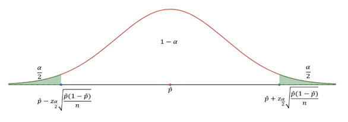

---
output:
  pdf_document: default
  html_document: default
---

# Inference for Proportion Worksheet (Point Estimates and Sampling Variability)

**Basic Terms**

-   Sample proportion $\hat{p} = \frac{x}{n}$\
-   Sample proportion $\hat{p}$ is the unbiased point estimator for the population proportion $p$
-   A value of $\hat{p}$ is a point estimate
-   Error = $\hat{p} - p$

## Central Limit Theorem (for Sampling Distribution of Sample Proportions)

When observations are independent (take random samples of fixed size $n$ without replacement); the sample size $n$ is large enough, i.e. $np \geq 10$ and $n(1-p) \geq 10$; and sample size $n < 10\%$ of the population size then the sample proportion $\hat{p}$ is approximately normal with mean = $p$ and standard deviation = $\sqrt{\frac{p(1-p)}{n}}$: $\hat{p} \sim N(p, \sqrt{\frac{p(1-p)}{n}})$

That is, $z = \frac{\hat{p} - p}{\sqrt{\frac{p(1-p)}{n}}} \sim N(0, 1)$.

**Notes:**

-   The requirement that the sample size $n < 10\%$ of population size is to have the standard deviation $\sqrt{\frac{p(1-p)}{n}}$.

-   If the sample size $n < 10\%$ of population size, then the $\sqrt{\frac{p(1-p)}{n}}$ is overly estimated SD, and the SD will typically adjust by a factor $\sqrt{\frac{N-n}{N-1}}$,i.e. $\sqrt{\frac{N-n}{N-1}} \times \sqrt{\frac{p(1-p)}{n}}$.

-   When using $\hat{p}$ to estimate $p$, the Standard Error of $\hat{p}$ is the standard deviation of its sampling distribution: $S.E._{\hat{p}} = \sqrt{\frac{\hat{p}(1-\hat{p})}{n}}$

-   When $p$ is unknown, $\hat{p}$ is used to replace $p$ then check $n\hat{p} \geq 10$ and $n(1-\hat{p}) \geq 10$ (success and failure condition) estimated $S.E. \approx \sqrt{\frac{\hat{p}(1-\hat{p})}{n}}$

**Exercise 1**

In a random sample with size $n=9000$, the count of “yes” is $x=250$.

*(a)* Compute the sample proportion $\hat{p} = \frac{x}{n}$.

*(b)* Compute the estimated standard error of the sample proportion $S.E. \approx \sqrt{\frac{\hat{p}(1-\hat{p})}{n}}$.

**Exercise 2**

In a random sample of 765 adults in the U.S., 322 say they could not cover \$600 unexpected expense without borrowing money or going to debt.

*(a)* What population is under consideration in the data set?

*(b)* What parameter is being estimated?

*(c)* Compute a point estimate for the parameter using the given information above?

*(d)* What is the estimated standard error?

**Exercise 3**

Of all freshmen at a large college, 19% made the dean’s list.

*(a)* What is the value of the interested parameter? State the sampling distribution of sample proportion for sample size 90.

*(b)* If a random sample of 90 freshmen selected 14 made the dean’s list. Compute the sample proportion and the Z-score.

*(c)* If a random sample of 90 freshmen selected 20 made the dean’s list. Compute the sample proportion and the Z-score.

*(d)* What is the probability that at most 14 of selected 90 freshmen made the dean’s list?

*(e)* What is the probability that between 14 to 20 students of selected 90 freshmen made the dean’s list?

**Inference for Proportion Worksheet (Confidence Interval)**

**Review**

About critical value $z^*$ or $z_{\alpha/2}$: For $N(0,1)$, $z_{\alpha/2}$ is the cut-off point with upper tail of probability $\alpha/2$

{width="350" height="110"}

**How to find** $z_{\alpha/2}$:

(1) For $100(1-\alpha)\%$ confidence level, find $\alpha$ then $\alpha/2$

(2) Use R: $qnorm\left(\frac{\alpha}{2}, \text{lower.tail} = \text{FALSE}\right)$ or $qnorm\left(1 - \frac{\alpha}{2}\right)$

**Common** $z_{\alpha/2}$ values:

| Confidence level | $\alpha$ | $z_{\alpha/2}$                       |
|------------------|----------|--------------------------------------|
| 90%              | 0.10     | $z_{0.05} = 1.644854 \approx 1.645$  |
| 95%              | 0.05     | $z_{0.025} = 1.959964 \approx 1.96$  |
| 98%              | 0.02     | $z_{0.01} = 2.326348 \approx 2.326$  |
| 99%              | 0.01     | $z_{0.005} = 2.575829 \approx 2.576$ |

**Construct** $100(1-\alpha)\%$ confidence interval: Use $\hat{p}$, $n$, and $z_{\alpha/2}$

$\hat{p} \pm z_{\alpha/2} \times \sqrt{\frac{\hat{p}(1-\hat{p})}{n}}$ (or $(\hat{p} - z_{\alpha/2} \times \sqrt{\frac{\hat{p}(1-\hat{p})}{n}}, \hat{p} + z_{\alpha/2} \times \sqrt{\frac{\hat{p}(1-\hat{p})}{n}})$)

{width="427"}

**Margin of Error (M.E.)**

$M.E. = z_{\alpha/2} \times \sqrt{\frac{\hat{p}(1-\hat{p})}{n}}$

So, C.I.: point estimate $\pm M.E.$

Note: the point estimate is the middle point; the $M.E.$ = half of the length of C.I.)

**Interpretation of C.I.:**

With the confidence level of $100(1-\alpha)\%$ and a sample proportion $\hat{p}$ with sample size $n$, we are $100(1-\alpha)\%$ confident that the population proportion $p$ is in the confidence interval $(\hat{p} - z_{\alpha/2} \times \sqrt{\frac{\hat{p}(1-\hat{p})}{n}}, \hat{p} + z_{\alpha/2} \times \sqrt{\frac{\hat{p}(1-\hat{p})}{n}})$

**Minimum sample size to guarantee the specified** $M.E. \leq a$

For known $p$: $n = \text{ceiling} \left[ \frac{p(1-p) \times z_{\alpha/2}^2}{a^2} \right]$

For unknown $p$: $n = \text{ceiling} \left[ \frac{1}{4} \times \frac{z_{\alpha/2}^2}{a^2} \right]$

**Exercise 1**

*(a)* Construct a 95% confidence interval using a sample proportion $\hat{p} = 0.3$ and sample size $n=1000$.

*(b)* Construct a 90% confidence interval using a sample proportion $\hat{p} = 0.3$ and sample size $n=1000$.

*(c)* Construct a 95% confidence interval using a sample proportion $\hat{p} = 0.3$ and sample size $n=100$.

**Exercise 2**. Circle the proper choices.

*(a)* The confidence interval is \_\_\_\_\_\_\_\_\_\_\_(wider/narrower) if the sample size is increasing.

*(b)* The confidence interval is \_\_\_\_\_\_\_\_\_\_\_(wider/narrower) if the confidence level is increasing.

**Exercise 3**

*(a)* Construct a 98% confidence interval using a sample proportion 45% and standard error 1.2%. (Assume that the CLT can be applied)

*(b)* Compute the margin of error using the same information of (a).

**Exercise 4**

A website is trying to increase registration of first-time visitors using a new site design. Of 752 randomly sampled visitors over a month who saw the new design, 64 registered.

*(a)* Compute the sample proportion.

*(b)* Compute the standard error.

*(c)* Construct and interpret a 90% confidence interval for the fraction of first-time visitors of the site who would register under the new design.

**Exercise 5**. For a confidence interval of proportion $(0.291, 0.309)$ find the following:

*(a)* The sample proportion that was used to create this C.I.

*(b)* The M.E. (Margin of Error)

**Exercise 6**

A public health survey is going to estimate the proportion of a population $p$ having defective vision. How many persons should be examined if the public health commissioner wishes to be 95% certain that the margin of error is below 0.04 when:

*(a)* $p$ is known to be about 0.45.

*(b)* There is no knowledge about the value of $p$?

**Note**. Similar result for mean:

-   CLT: In random sampling from a population with mean $\mu$ and standard deviation $\sigma$, when the sample size $n$ is large ($n \geq 30$), the distribution of sample mean $\bar{X}$ is approximately normal: $\bar{X} \sim N(\mu, \frac{\sigma}{\sqrt{n}})$.

-   Use $\bar{x}$ as point estimate for $\mu$.

-   $S.E. = \frac{\sigma}{\sqrt{n}} \approx \frac{s}{\sqrt{n}}$

-   $100(1-\alpha)\%$ confidence interval for mean: $\bar{x} \pm z_{\alpha/2} \times \sqrt{\frac{s}{n}}$ or $(\bar{x} - z_{\alpha/2} \times \sqrt{\frac{s}{n}}, \bar{x} + z_{\alpha/2} \times \sqrt{\frac{s}{n}})$

-   $M.E. = z_{\alpha/2} \times S.E. = z_{\alpha/2} \times \sqrt{\frac{s}{n}}$

**Exercise 7**

The GSS (General Social Survey) asked the question: “For how many days during the past 30 days was your mental health not good (stress, depression, with emotions)?” Based on responses from 1151 US residents, a 95% confidence interval (3.40, 4.24) (days) was reported in 2014.

*(a)* Determine the sample mean (days).

*(b)* Determine the margin of error (M.E.).

*(c)* What is the value of $z_{\alpha/2}$ for 95% confidence level?

*(d)* Write a sentence to interpret this confidence interval.

### Inference for Proportion Worksheet (Hypothesis Testing for $p$)

**Learning Objectives:**

Be able to

-   State appropriate hypotheses about a population parameter
-   Compute a p-value using a sample and interpret the p-value
-   Make an appropriate conclusion based on a p-value and a specified significance level

**Hypothesis Testing Steps**

1.  Formulate the null hypothesis and the alternative hypothesis
2.  Use sample to compute p-value (or compute the test statistic and use the rejection region based on given significance level)
3.  Make decision for specified significance level

**Formulation of Hypothesis**

**The null hypothesis:** $H_0: p = p_0$

**The alternative hypothesis is one of the three:**

-   $H_a: p > p_0$ (right-sided) (or right-tailed)
-   $H_a: p < p_0$ (left-sided) (or left-tailed)
-   $H_a: p \neq p_0$ (two-sided) (or two-tailed)

**What is p-value**

A p-value is the calculated probability of observing data at least as favorable to the alternative hypothesis, assuming that the null hypothesis is true (in this section, we use the observed $\hat{p}$, and under assumption the sample proportion $\sim N(p_0, \sqrt{\frac{p_0(1-p_0)}{n}})$)

**How to compute p-value**

Use a sample of sample size $n$ with sample proportion $\hat{p}=p_1$, under the assumption that:

$\hat{p}$ $\sim N(p_0, \sqrt{\frac{p_0(1-p_0)}{n}})$).

Let $z_1 = \frac{p_1 - p_0}{\sqrt{\frac{p_0(1-p_0)}{n}}}$ (this is called the $z$-test statistic)

-   For left-sided test, p-value is $P(\hat{p} < p_1)$, or $P(Z < z_1)$,

use pnorm $({p_1, p_0,}{\sqrt{\frac{p_0(1-p_0)}{n}}})$ or pnorm $(z_1)$

-   For right-sided test, p-value is $P(\hat{p} > p_1)$, or $P(Z > z_1)$, use pnorm$({p_1,p_0,}{\sqrt{\frac{p_0(1-p_0)}{n}}}, lower.tail = FALSE)$ or

pnorm $(z_1, lower.tail = FALSE)$

-   For two-sided test, p-value is $P(|Z| > |z_1|)$, use 2\*pnorm $(-|z_1|)$ or

2\*pnorm $(|z_1|, lower.tail = FALSE)$

**Make decision by comparing p-value with significance level** $\alpha$

-   If p-value $\leq \alpha$, then we have enough evidence to reject $H_0$ and substantiate $H_a$;

-   If p-value $> \alpha$, then we do not have enough evidence to reject $H_0$

-   The default value of significance level is $\alpha = 0.05$

**Using confidence interval for two-sided test**

For $H_0: p = p_0$, $H_a: p \neq p_0$ (two-sided) and significance level $\alpha$, construct a $100(1-\alpha)\%$ confidence interval: $\hat{p} \pm z_{\alpha/2} \times \sqrt{\frac{\hat{p}(1-\hat{p})}{n}}$

Make decision:

-   If $p_0$ is not in the C.I. then we reject $H_0$ in favor of $H_a$;
-   If $p_0$ is in the C.I. then we fail to reject $H_0$.

**Type I and Type II errors**

| Truth      | Test conclusion | do not reject $H_0$ | reject $H_0$ in favor of $H_A$ |
|------------|-----------------|---------------------|--------------------------------|
| $H_0$ true |                 | okay                | Type 1 Error                   |
| $H_A$ true |                 | Type 2 Error        | okay                           |

**Exercise 1**

Formulate the null and alternative hypotheses in the following situations:

*(a)* A company claims that the proportion of its customers that have complaints against the company is now less than 0.13.

*(b)* An inspector wants to establish that 2×4 lumber at a mill does not meet a specification that requires at most 5% break under a standard load.

*(c)* A university official believes that the proportion of students who currently hold part-time jobs has changed from the value 0.26 that prevailed four years ago.

**Exercise 2**

A census recorded five years ago that 20% of the families in a large community lived below the poverty level. To determine if this percentage has changed, a random sample of 400 families is studied and 70 are found to be living below the poverty level. Does this finding indicate that the current percentage of families earning income below the poverty level has changed from what it was five years ago? (Use significance level $\alpha=0.05$)

Follow the steps to conduct the hypotheses testing:

*(a)* Formulate the hypotheses

*(b)* Compute the sample proportion

*(c)* Compute the test statistic

*(d)* Compute the p-value

*(e)* Draw conclusion using the significance level $\alpha=0.05$.

**Exercise 3**

Conduct hypotheses testing.

Follow the example (Please redo the example by yourself)

**Example**

Claim: $p<0.32$, $n=120$, $p=0.233$, $\alpha=0.05$

**Solution**

*(a)* Formulate the hypotheses: $H_0: p=0.32$, $H_a: p<0.32$

*(b)* Compute the $z$-test statistic: $z = \frac{0.233-0.32}{\sqrt{\frac{0.32 \times 0.68}{120}}} = -2.043057$ (R-code: `(0.233-0.32)/sqrt(0.32*0.68/120)`)

*(c)* Compute the p-value: p-value $= P(Z < -2.043057) = 0.020534$ (R-code: `pnorm(-2.043057)`)

*(d)* Draw conclusion: since the p-value is less than $\alpha$, $0.0205 < 0.05$, we reject the null hypothesis and support the alternative hypothesis: We have strong evidence to support the claim that the proportion is less than 0.32 ($p<0.32$).

Do the following hypotheses testing for given claims, sample size, sample proportion, and significance level:

1.  Claim: $p<0.56$, $n=86$, $\hat{p}=0.387$, $\alpha=0.10$

2.  Claim: $p>0.75$, $n=228$, $\hat{p}=0.818$, $\alpha=0.02$

3.  Claim: $p \neq 0.60$, $n=77$, $\hat{p}=0.709$, $\alpha=0.02$

4.  Claim: $p \neq 0.60$, $n=77$, $\hat{p}=0.565$, $\alpha=0.02$
