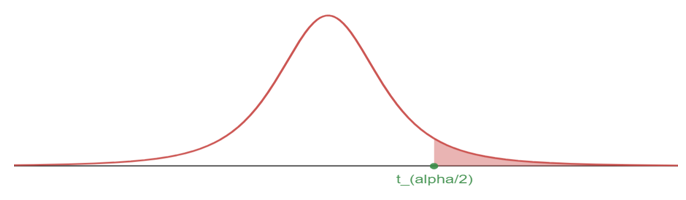

---
output:
  pdf_document: default
  html_document: default
---

# Inference for Mean

## Quick Review on Inference for Mean
### Objectives

By the end of this unit, students will be able to:

::: {.blue-background}
- Distinguish between normal distribution and t distribution.
- Compute point estimates and confidence intervals for estimating one population mean based on one sample and paired samples.
:::

### Overview

**One-sample means with the t-distribution**

Similar to how we can model the behavior of the sample proportion $\hat p$ using a normal distribution, the sample mean $\bar x$ can also be modeled using a normal distribution when certain conditions are met. However, we will soon learn that a new distribution, called the $t$-distribution, then we will use it to construct confidence intervals and conduct hypothesis tests for the mean.

**The sampling distribution of $\bar x$**

The sample mean tends to follow a normal distribution centered at the population mean, $\mu$, when certain conditions are met. Additionally, we can compute a standard error for the sample mean using the population standard deviation $\sigma$ and the sample size $n$.


***Central limit theorem for the sample mean***

When we collect a sufficiently large sample of $n$ independent observations from a population with mean $\mu$ and standard deviation $\sigma$, the sampling distribution of $\bar x$ will be nearly normal with

$$\text{Mean} = \mu ~~~~~~~~~~~~~~~~~~~~~ \text{Standard Error}(SE) = \frac{\sigma}{\sqrt{n}} $$

Before diving into confidence intervals and hypothesis tests using $\bar x$, we first need to conver two topics:

-   When we modeled $\hat p$ using the normal distribution, certain conditions had to be satisfied. The conditions for working with $\bar x$ are a little more complex, and we will spend the next section discussing how to check conditions for inference.

-   The standard error is dependent on the population standard deviation, $\sigma$. However, we rarely know $\sigma$, and instead we must estimate it. Because this estimation is itself imperfect, we use a new distribution called the $t$-distribution to fix this problem.

**Evaluating the two conditions required for modeling $\bar x$**

Two conditions are required to apply the Central limit theorem for a sample mean $\bar x$:

**Independence.** The sample observations must be independent. The most common way to satisfy this condition is when the sample is a simple random sample from the population. If the data comes from a random process, analogus to rolling a die, this would also satisfy the independence condition.

**Normality.** When a sample is small, we also require that the sample observations come from a normally distributed population. We can relax this condition more and more for larger and larger sample sizes. This condition is obviously vague, making it difficult to evaluate, so next we introduce a couple rules of thumb to make checking this condition easier.

**Rules of thumb: How to perform the normality check**

There is no perfect way to check the normality condition, so instead we use two rules of thumb:

-   **n \< 30 :** If the sample size $n$ is less than 30 and there are no clear outliers in the data, then we typically assume the data come from a nearly normal distribution to satisfy the condition.

-   $\mathbf{n \ge 30:}$ If the sample size $n$ is at least 30 and there are no *particularly extreme* outliers, then we typically assume the sampling distribution of $\bar x$ is nearly normal, even if the underlying distribution of individual observations is not.

In this section, you aren't expected to develop perfect judgement on the normality condition. However, you are expected to be able to handle clear cut cases based on the rules of thumb.

In practice, it's typical to also do a mental check to evaluate whether we have reason to believe the underlying population would have moderate skew (if $n < 30$) or have aprticularly extreme outliers ($n \ge 30$) beyond what we observe in the data. For example, consider the number of followers for each individual account on Twitter, and then imagine the distribution. The large majority of accounts have built up a couple thousand followers or fewer, while relatively tiny fraction have amassed tens of millions of followers, meaning the distribution is extremely skewed. When we know the data come from such an extremely skewed distribution, it takes some effor to understand what sample size is large enough for the normality condition to be satisfied.

**Introducing the $t$-distribution**

In practice, we cannot directly calculate the standard error for $\bar x$ since we do not know the population standard deviation, $\sigma$. We encountered a similar issue when computing the standard error for a sample proportion, which relied on the population proportion, $p$. Our solution in the proportion context was to use sample value in place of the population value when computing the standard error. We will employ a similar strategy for computing the standard error of $\bar x$, using the sample standard deviation $s$ in place of $\sigma$:

$$ SE = \frac{\sigma}{\sqrt{n}} \approx \frac{s}{\sqrt{n}} $$

This strategy tends to work well when we have a lot of data and can estimate $\sigma$ using $s$ accurately. However, the estimate is less precise with smaller samples, and this leads to problems when using the normal distribution to model $\bar x$.

We will find it useful to use a new distribution for inference called the $\mathbf{t}$**-distribution**. A $t$- distribution, shown as a solid line in the figure below, has a bell shape. However, its tails are thicker than the normal distribution's, meaning observations are more likely to fall beyond two standard deviations from the mean than under the normal distribution. The extra thick tails of the $t$-distribution are exactly the correction needed to resolve the problem of using $s$ in place of $\sigma$ in the $SE$ calculation.

{width="80%"}

The $t$-distribution is always centered at zero and has a single parameter: degrees of freedom. The **degrees of freedom** $\mathbf{(df)}$ describes the precise form of the bell-shaped $t$-distribution. Several $t$-distributions are shown in the figure below in comparison to the normal distribution.

In general, we will use a $t$-distribution with $df = n-1$ to model the sample mean when the sample size is $n$. That is, when we have more observations, the degrees of freedom will be larger and the $t$-distribution will look more like the standard normal distribution: when the degrees of freedom is about 30 or more, the $t$-distribution is nearly indistinguishable from the normal distribution.

{width="80%"}

**Degrees of Freedom** $\mathbf(df)$

The degrees of freedom describes the shape of the $t$-distribution. The larger the degrees of freedom, the more closely the distribution approximates the normal model.

When modeling $\bar x$ using the $t$-distribution, use $df = n - 1$.

The $t$-distribution allows us greater flexibility than the normal distribution when analyzing numerical data. In practice, its common to use a statistical software, such as R, Python or SAS for these analyses. Alternatively, a graphing calculator or a **t-table** may be used; the $t$-table is similar to the normal distribution table.

{width="80%"}

{width="80%"}

In the normal model, we used $z^*$ and the standard error to determine the width of a confidence interval. We revise the confidence interval formula slightly when using the $t$-distribution:

$$ point~estimate \pm t^*_{df} \times SE ~~~~~\rightarrow~~~~~ \bar x \pm t^*_{df} \times \frac{s}{\sqrt{n}} $$

**Confidence interval for a single mean**

Once you've determined a one-mean confidence interval would be helpful for an application, there are four steps to constructing the interval:

**Prepare.** Identify $\bar x, s, n,$ and determine what confidence level you wish to use.

**Check.** Verify the conditions to ensure $\bar x$ is nearly normal.

**Calculate.** If the conditions hold, compute, $SE$, find $t^*_{df}$ and construct the interval.

**Conclude.** Interpret the confidence interval in the context of the problem.

**One sample $t$-tests**

Is the typical US runner getting faster or slower over time? We consider this question in the context of the Cherry Blossom Race, which is a 10-mile race in Washington, DC each spring.

The average time for all runner who finished the Cherry Blossom Race in 2006 was 93.29 minutes (93 minutes and about 17 seconds). We want to determine using data from 100 participants in the 2017 Cherry Blossom Race whether runners in this race are getting faster or slower, versus the other possibility that there has been no change.

When completing a hypothesis test, for the one-sample mean, the process is nearly identical to completing a hypothesis test for a single proportion. First, we find the Z-score using the observed value, null value, and standard error; however, we call it a **T-score** since we use a $t$-distribution for calculating the tail area. Then we find the p-value using the same ideas we used previously: find the one-tail area under the sampling distribution, and double it.

{width="80%"}

With both the independence and normality conditions satisfied, we can proceed with a hypothesis test using the $t$-distribution. 


### Solved Problem

Just like the normal distribution, we can use R to find the area to the below a certain standard deviation.

We can find the area to the left of 1.75 standard deviations with 12 degrees of freedom by using the following:

```{r pt1_example}
pt(1.75, df = 12)
```


What proportion of the $t$-distribution with 18 degrees of freedom falls below -2.10?

To find the two tailed proportion with 2 degrees of freedom more than 3 units from the mean, we will do the following

```{r pt2_1_example}
2*pt(-3, df = 2, lower.tail = TRUE)
```

OR

```{r pt2_2_example}
pt(-3, df = 2, lower.tail = TRUE) + pt(3, df = 2, lower.tail = FALSE)
```

OR

```{r pt2_3_example}
pt(-3, df = 2, lower.tail = TRUE) + 1 -  pt(3, df = 2, lower.tail = TRUE)
```

We can see that there are multiple ways to acquire the same results by modifying the arguments with the use of the complement rule.


### Exercises

-   Sample mean $\bar{x}$ is the unbiased **point estimator** for the population mean $\mu$
-   A value of $\bar{x}$ is a point estimate
-   Error = $\mu - \bar{x}$

**Central Limit Theorem (Sampling distribution of sample mean)**


When taking samples of fixed size $n$ from a population with mean $\mu$ and standard deviation $\sigma$, when the observations are independent (take random samples of fixed size $n$, without replacement); the sample size $n \geq 30$, then the sample proportion $\bar{x}$ is approximately normal: $\bar{x} \sim N(\mu, \frac{\sigma}{\sqrt{n}})$.

When we know the population is normal, no matter what sample size, $\bar{x} \sim N(\mu, \frac{\sigma}{\sqrt{n}})$

**Notes:**

-   When using $\bar{x}$ to estimate $\mu$ the Standard Error of $\bar{x}$ is the standard deviation of its sampling distribution: $S.E. = \frac{\sigma}{\sqrt{n}}$
-   Usually $\sigma$ is unknown use $s$ to replace $\sigma$: $S.E. \approx \frac{s}{\sqrt{n}}$

**When can the CLT be applied**

-   If $n \geq 30$ and $\sigma$ is known
-   If the population is normal and $\sigma$ is known
-   Otherwise we use t-distribution: $T = \frac{\bar{x} - \mu}{s/\sqrt{n}} \sim t_{df}$, where $df=n-1$ is the degree of freedom.

**t-distribution**

Similar to the standard normal distribution: the probability density curve of a t-distribution is centered at 0, and it is bell-shaped. But tails of a t-distribution are thicker than that of the standard normal distribution; moreover, the lower $df$, the thicker the tails.

{width="500"}

**Using R to find probability under t-distribution with** $df=n-1$:

-   For $P(T < b)$: `pt(b, df)`
-   For $P(T > a)$: `pt(a, df, lower.tail = FALSE)` or `1 - pt(a, df)`
-   For $P(a < T < b)$: `pt(b, df) - pt(a, df)`

{width="550"}

**To find the cut-off point** $t$ (critical value $t^*$ or $t_{\alpha/2}$) for a given cumulative probability with $df=n-1$:

-   Find $t$ for $P(T < t) = p$: `qt(p, df)`
-   Find $t$ for $P(T > t) = p$: `qt(1 - p, df)` or `qt(p, df, lower.tail = FALSE)`
-   $t_{\alpha/2}$: $P(T > t_{\alpha/2})$ = $\alpha/2$: $qt(\alpha/2, df, lower.tail = FALSE)$

{width="500"}

**100**$(1-\alpha)\%$ Confidence interval for mean $\mu$

Using sample with size $n$, sample mean $\bar{x}$, sample standard deviation $s$, the critical value $t_{\alpha/2}$: $\bar{x} \pm t_{\alpha/2} \times \frac{s}{\sqrt{n}}$

**Margin of Error (M.E.)**

$M.E. = t_{\alpha/2} \times S.E. = t_{\alpha/2} \times \frac{s}{\sqrt{n}}$

## Hypothesis Testing for mean $\mu$ 

### Objectives

By the end of this unit, students will be able to:

::: {.blue-background}
- Formulate claims about a population mean in the form of a null hypothesis and alternative hypothesis.
- Conduct t-tests for testing claims about a single population mean based on one sample and paired samples.
:::

### Overview

**One sample t-test (Same framework as the Hypothesis Testing for proportion)**

**Steps:**

1.  Set up the hypotheses

2.  Compute the t test statistic

    Using sample with size $n$, sample mean $\bar{x}$, sample standard deviation $s$, null value $\mu_0$,

    $T = \frac{\bar{x} - \mu_0}{s/\sqrt{n}}$

3.  Compute the p-value

    Let t-test statistic $t_1 = \frac{\bar{x} - \mu_0}{s/\sqrt{n}}$ (from step 2)

    -   For left-sided test, p-value is $P(T < t_1)$ use `pt(t, df)`

    -   For right-sided test, p-value is $P(T > t_1)$ use `pt(t, df, lower.tail = FALSE)`

    -   For two-sided test, p-value is $P(|T| > |t_1|)$ use $2*pt(-|t_1|, df)$ or $2*pt(|t_1|, df, lower.tail = FALSE)$

4.  Compare the p-value with the significance level $\alpha$ and make decision

    -   If p-value $\leq \alpha$, then we have enough evidence to reject $H_0$ and substantiate $H_a$;

    -   If p-value \> $\alpha$, then we do not have enough evidence to reject $H_0$

    -   The default value of significance level is $\alpha = 0.05$

**Hypothesis testing for a single mean**

Once you have determined a one-mean hypothesis test is the correct procedure, there are four steps to completing the test:

**Prepare.** Identify the parameter of interest, list out hypotheses, identify the significance level, and identify $\bar x,s$ and $n$.

**Check.** Verify conditions to ensure $\bar x$ is nearly normal.

**Calculate.** If the conditions hold, compute $SE$, compute the T-score, and identify the p-value.

**Conclude.** Evaluate the hypothesis test by comparing the p-value to $\alpha$, and provide a conclusion in the context of the problem/.

**Paired Data**

In an earlier edition of this text book, we found that Amazon prices were, on average, lower than those of the UCLA Bookstore for UCLA courses in 2010. It's been several years, and many stores have adapted to the online market, so we wondered, how is the UCLA Bookstore doing today?

We sampled 201 UCLA courses. Of those, 68 required books could be found on Amazon. A portion of the data set from these courses is shown in the table below, where the prices are in US dollars.

|          | subject                 | course_number | bookstore | amazon   | price_difference |
|----------|-------------------------|---------------|-----------|----------|------------------|
| 1        | American Indian Studies | M10           | 47.97     | 47.45    | 0.52             |
| 2        | Anthropology            | 2             | 14.26     | 13.55    | 0.71             |
| 3        | Arts and Architecture   | 10            | 13.50     | 12.53    | 0.97             |
| $\vdots$ | $\vdots$                | $\vdots$      | $\vdots$  | $\vdots$ | $\vdots$         |
| 68       | Jewish studies          | M10           | 35.96     | 32.40    | 3.56             |


**Paired observations:**

Each textbook has two corresponding prices in the data set: one for the UCLA Bookstore and one for Amazon. When two sets of observations have this special correspondence, they are said to be **paired**.

**Paired data**

Two sets of observations are *paired* if each observation in one set has a special correspondence or connection with exactly one observation in the other data set.

To analyze paired data, it is often useful to look at the difference in outcomes of each pair of observations. In the textbook data, we look at the differences in prices, which is represented as the `price_difference` variable in the data set. Here the differences are taken as

$$  \text{UCLA Bookstore price} - \text{Amazon price} $$

It is important that we always subtract using a consistent order; here Amazon prices are always subtracted from UCLA prices. The first difference shown in the table above is computed as $47.97 - 47.45 = 0.52$. Similarly, the second difference is computed as $14.26 - 13.55 = 0.71$, and the third is $13.50 - 12.53 = 0.97$. A histogram of the differences is shown in the figure below. Using differences between paired observations is a common and useful way to analyze paired data.

{width="80%"}

**Inference for paired data**

To analyze a paired data set, we simply analyze the differences.

$$n_{diff} = 68~~~~~\bar{x}_{diff} = 3.58~~~~~s_{diff} = 13.42 $$

Lets set up a hypothesis test to determine whether, on average, there is a difference between Amazon's price for a book and the UCLA bookstore's price. Also, check the conditions for whether we can move forward with the test using the $t$-distribution.

We are considering two scenarios: there is no difference or there is some difference in average prices.

$$H_0: \mu_{diff} = 0. \text{ There is no difference in the average textbook price.}$$

$$H_A: \mu_{diff} \ne 0. \text{ There is a difference in average prices.}$$

Next, we will check the independence and normality conditions.

The observations are based on a simple random sample, so independence is reasonable. While there are some outliers, $n = 68$ and none of the outliers are particularly extreme, so the normality of $\bar x$ is satisfied. With these conditions satisfied, we can move forward with the $t$-distribution.

To compute the test, we need to compute the standard error associated with $\bar{x}_{diff}$ using the standard deviation of the differences ($s_{diff} = 13.42$) and the number of differences ($n_{diff} = 68$):

$$SE_{\bar{x}_{diff}} = \frac{s_{diff}}{\sqrt{n_{diff}}} = \frac{13.42}{\sqrt{68}} = 1.63$$

The test statistics is the T-score of $\bar{x}_{diff}$ under the null condition that the actual mean difference is 0:

$$T = \frac{\bar{x}_{diff} - 0}{SE_{\bar{x}_{diff}}} = \frac{3.58 - 0}{1.63} = 2.20$$

To visualize the p-value, the sampling distribution of $\bar{x}_{diff}$ is drawn as though $H_0$ is true, and the p-value is represented by the two shaded tails:

{width="80%"}

The degrees of freedom is $df = 68 -1 = 67$. Using R, we find the one-tail area of 0.0156. Doubling this area gives the p-value: 0.0312.

```{r t_example7_18}
2*pt(2.20, df = 67, lower.tail = FALSE)
```

Because the p-value is less than 0.05, we reject the null hypothesis. Amazon prices are, on average, lower than the UCLA Bookstore prices for UCLA courses.


### Solved Problem

### Exercises    

**Exercise 1**

Without finding the values, arrange the numbers from small to large:

a)  $P(Z < -1.25)$\
b)  $P(T < -1.25)$ with $df=10$\
c)  $P(T < -1.25)$ with $df=15$\
d)  $P(Z > 1.35)$\
e)  $P(T > 1.35)$ with $df=10$\
f)  $P(T > 1.25)$ with $df=15$

$$ \_\_\_\_\_\_ < \_\_\_\_\_\_ < \_\_\_\_\_\_ < \_\_\_\_\_\_ < \_\_\_\_\_\_ < \_\_\_\_\_\_ $$

**Exercise 2**

Use R calculator to find the values of the probability of t-distribution. Sketch the t-curve and shaded region.

-   $P(T < -1.25)$ with $df=10$
-   $P(T < -1.25)$ with $df=15$
-   $P(T > 1.35)$ with $df=10$
-   $P(T > 1.25)$ with $df=15$

**Exercise 3**

Use R calculator to find the critical t-value $(t_{\alpha/2})$, rounded the result to 4 decimal places.

-   CL = 90%, $n = 7$
-   CL = 98%, $n = 20$
-   CL = 99%, $n = 28$
-   CL = 95%, $n = 9$

**Exercise 4**

Find confidence interval with the sample information:

*(a)* $n=5, \bar{x}=4.1, s=1.2$, 90% confidence level

*(b)* $n=15, \bar{x}=4.1, s=1.2$, 90% confidence level

*(c)* $n=5, \bar{x}=4.1, s=1.2$, 98% confidence level

*(d)* $n=15, \bar{x}=4.1, s=1.2$, 98% confidence level

**Exercise 5**

What affects the width of the confidence interval? (You may use your observations from Exercise 4 for reference)

**Exercise 6**

(Working backwards) A 95% confidence interval for a population mean $\mu$ is given as (18.98, 20.02). This confidence interval is based on a simple random sample of 36 observations. Calculate the following:

*(a)* The sample mean

*(b)* The margin of error

*(c)* The critical t-value (use t-distribution)

*(d)* The standard error (use the result of c)

*(e)* The sample standard deviation (use the result of d)

**Exercise 7**

Find the P-value for the given sample sizes and test statistic:

*(a)* $n=26$, $T=2.485$, for right-sided test

*(b)* $n=18$, $T=-1.45$, for left-sided test

*(c)* $n=26$, $T=2.485$, for two-sided test

*(d)* $n=18$, $T=-1.45$, for two-sided test

**Exercise 8**

A random sample of 25 New Yorkers were asked how much sleep they get per night. The result shows:

$n=25, \bar{x}=7.73, s=0.77$

The point estimate suggests that New Yorkers sleep less than 8 hours per night on average. Is the result statistically significant?

Follow the steps to conduct the hypothesis test.

*(a)* Write the hypotheses in symbols: $H_0$: \_\_\_\_\_\_\_\_\_\_\_\_ $H_a$: \_\_\_\_\_\_\_\_\_\_\_\_

*(b)* Calculate the test statistic

*(c)* Compute the P-value and draw a picture

*(d)* What is the conclusion of the hypothesis test, using the significance level $\alpha=0.05$

*(e)* If you were to construct a 90% confidence interval that corresponds to this hypothesis test, would you expect 8 hours a night on average to be in the interval?

**Exercise 9**

Georgianna claims that in a small city, the average child takes less than 5 years of piano lessons. We have a random sample of 20 children from the city, with a mean of 4.6 years of piano lessons and a standard deviation of 2.2 years. Evaluate Georgianna’s claim using a hypothesis test.

*(a)* Write the hypotheses in symbols: $H_0$: \_\_\_\_\_\_\_\_\_\_\_\_ $H_a$: \_\_\_\_\_\_\_\_\_\_\_\_

*(b)* Calculate the test statistic

*(c)* Compute the P-value and draw a picture

*(d)* What is the conclusion of the hypothesis test, using the significance level $\alpha=0.05$
