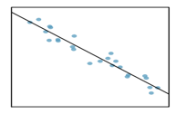

---
output:
  html_document: default
  word_document: default
  pdf_document: default
---

# Linear Regression
## Introduction to Linear Regression

### Objectives

By the end of this unit, students will be able to:

::: {.blue-background}
- Describe linear associations between numerical variables using correlations.
- Use linear regression to model linear relationships between two numerical variables.
- Evaluate the statistical significance of linear relationships between numerical variables.
:::

### Overview

Regression analysis concerns the study of relationships between quantitative variables: identifying, estimating, and validating the relationship.

-   (Simple) linear regression is to study if the relationship between two numerical variables is linear, and the strength of the linear association.

-   We begin with the scatter plot of two numerical variables, to observe if there is a linear association.

-   If there seems to be a linear relationship, we use the linear model $y = \beta_0 + \beta_1x$ to best fit the data.

-   Using a sample data set $(x_i, y_i)$ for $i = 1, \ldots, n$ and least squares error, we derive an estimated model $\hat{y} = b_0 + b_1x$.

Let's check in with a few short videos from our friends at OpenIntro.org to help develop the notion of linear regression for us.

<iframe width="560" height="315" src="https://www.youtube.com/embed/mPvtZhdPBhQ" frameborder="0" allow="accelerometer; autoplay; encrypted-media; gyroscope; picture-in-picture" allowfullscreen></iframe>

<iframe width="560" height="315" src="https://www.youtube.com/embed/z8DmwG2G4Qc" frameborder="0" allow="accelerometer; autoplay; encrypted-media; gyroscope; picture-in-picture" allowfullscreen></iframe>

Simple linear regression uses a single numerical feature (predictor variable) to predict a numerical response. Simple linear regression uses the form of a straight line $y = mx + b$, where $m$ denotes slope of the relationship and $b$ denotes the intercept (the value of $y$ if $x$ is 0). With regression, we are fitting a straight line to data, where noise is present -- that is, the line we fit is not expected to pass through all of the data points. The form for a simple regression model is
$$\displaystyle{y = \beta_0 + \beta_1x + \varepsilon}$$

Notice that $\beta_0$ is the intercept, $\beta_1$ is the slope, and $\varepsilon$ denotes the unexplained error (noise). We typically do not write $\varepsilon$ as part of the model, since we assume that it is random noise with a mean of $0$ and a constant standard deviation ($\sigma$) -- in our earlier notation, we assume $\varepsilon \sim N\left(\mu = 0, \sigma\right)$. Instead, we often write the regression model as
$$\displaystyle{\mathbb{E}\left[y\right] = \beta_0 + \beta_1x}$$

Let's see regression in action as we consider an application to understanding biases in course evaluations.

**The Data**

Many college courses conclude by giving students the opportunity to evaluate the course and the instructor anonymously. However, the use of these student evaluations as an indicator of course quality and teaching effectiveness is often criticized because these measures may reflect the influence of non-teaching related characteristics, such as the physical appearance of the instructor. The article titled, "Beauty in the classroom: instructors' pulchritude and putative pedagogical productivity" (Hamermesh and Parker, 2005) found that instructors who are viewed to be better looking receive higher instructional ratings. (Daniel S. Hamermesh, Amy Parker, Beauty in the classroom: instructors pulchritude and  putative pedagogical productivity, *Economics of Education Review*, Volume 24, Issue 4, August 2005, Pages 369-376, ISSN 0272-7757, 10.1016/j.econedurev.2004.07.013. [http://www.sciencedirect.com/science/article/pii/S0272775704001165](http://www.sciencedirect.com/science/article/pii/S0272775704001165).)

In this workbook we will analyze the data from this study in order to learn what goes into a positive professor evaluation.

The data were gathered from end of semester student evaluations for a large sample of professors from the University of Texas at Austin. In addition, six students rated the professors' physical appearance. (This is a slightly modified version of the original data set that was released as part of the replication data for *Data Analysis Using Regression and Multilevel/Hierarchical Models* (Gelman and Hill, 2007).) The result is a data frame where each row contains a different course and columns represent variables about the courses and professors.

variable         | description
---------------- | --------------------------------------
`score`          | average professor evaluation score: (1) very unsatisfactory - (5) excellent.
`rank`           | rank of professor: teaching, tenure track, tenured.
`ethnicity`      | ethnicity of professor: not minority, minority.
`gender`         | gender of professor: female, male.
`language`       | language of school where professor received education: english or non-english.
`age`            | age of professor.
`cls_perc_eval`  | percent of students in class who completed evaluation.
`cls_did_eval`   | number of students in class who completed evaluation.
`cls_students`   | total number of students in class.
`cls_level`      | class level: lower, upper.
`cls_profs`      | number of professors teaching sections in course in sample: single, multiple.
`cls_credits`    | number of credits of class: one credit (lab, PE, etc.), multi credit.
`bty_f1lower`    | beauty rating of professor from lower level female: (1) lowest - (10) highest.
`bty_f1upper`    | beauty rating of professor from upper level female: (1) lowest - (10) highest.
`bty_f2upper`    | beauty rating of professor from second upper level female: (1) lowest - (10) highest.
`bty_m1lower`    | beauty rating of professor from lower level male: (1) lowest - (10) highest.
`bty_m1upper`    | beauty rating of professor from upper level male: (1) lowest - (10) highest.
`bty_m2upper`    | beauty rating of professor from second upper level male: (1) lowest - (10) highest.
`bty_avg`        | average beauty rating of professor.
`pic_outfit`     | outfit of professor in picture: not formal, formal.
`pic_color`      | color of professor's picture: color, black & white.

**Prediction (Predicted value)**

If the least square regression model is given by $\hat{y} = b_0 + b_1x$, then for a given $x$, the predicted value is $\hat{y} = b_0 + b_1x$ -- plug in the value of $x$.

**Interpreting the slope and the y-intercept of a regression line**

-   The slope $b_1$ is the amount by which the predicted value $y$ changes when $x$ is increased by one unit.

-   The y-intercept $b_0$ is the predicted value of $y$ when $x = 0$.

**Residual**

For a data set $(x_i, y_i)$ for $i = 1, \ldots, n$, the error of using the model is: $e_i = y_i - \hat{y}_i = y_i - (b_0 + b_1x_i)$

**The Correlation Coefficient**

-   The mathematical formula is:

$R = \frac{1}{n-1}\sum_{i=1}^n \frac{(x_i - \bar{x})(y_i - \bar{y})}{s_x s_y}$

-   The value of $R$: $-1 \leq R \leq 1$

-   The closer $|R|$ is to 1, the stronger the linear association.

**The Coefficient of Determination:** $R^2$

-   The coefficient of determination $R^2$ is a measure used in statistical analysis to assess how well a model explains and predicts future outcomes.

-   $R^2$ is the proportion (fraction) of the variation in the response variable that is predictable (can be explained) from the explanatory variable.

**Conditions to have the least squares regression**

Visually inspect the scatter plot:

-   The relationship between the explanatory and the response variable should be linear.
-   The histogram of residuals distribution should be normal (symmetric, bell-shaped).
-   The variability of points should be roughly constant.
-   No extreme outliers.

**Computing the coefficients in** $\hat{y} = b_0 + b_1x$

$b_1 = \frac{s_y}{s_x} R$

$b_0 = \bar{y} - b_1 \bar{x}$

**Notes**

1.  $R$ and $b_1$ have the same sign.

2.  Equivalently, $R = \frac{s_x}{s_y} b_1$

### Solved Problem

### Exercises

**Exercise 1**

Describe the linear relationship from the scatter plot.

{width="200"}

Select the correct choice.

*(a)* Strong positive relationship

*(b)* Strong negative relationship

*(c)* Weak positive relationship

*(d)* Weak negative relationship

**Exercise 2**

The mean travel time from one stop to the next on the Coast Starlight is 129 minutes, with a standard deviation of 113 minutes. The mean distance from one stop to the next is 108 miles with a standard deviation of 99 miles. The correlation between travel time and distance is 0.636.

*(a)* Write the equation of the regression line for predicting travel time (based on the distance).

*(b)* Interpret the slope and the intercept in this context.

*(c)* Calculate and interpret $R^2$.

*(d)* The distance between Santa Barbara and LA is 103 miles. Use this model to estimate the time it takes to travel between these two cities.

*(e)* It actually takes the Coast Starlight about 168 minutes to travel between Santa Barbara and LA. Calculate the residual. Is the model over or underestimating the time?
