#CH4 WORKSHEET: Discrete Random Variables

**Exercise: Profit from crop yield under different weather conditions (X).**

## Questions

1. Determine the missing probability in the following distribution.

  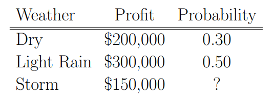</img>

2. Find the expected profit from this crop, $\mu$.

  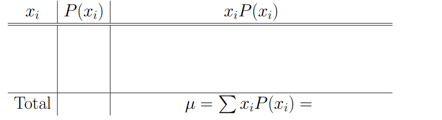</img>

3. Find the variance, $\sigma^2$ and the standard deviation, $\sigma$.

  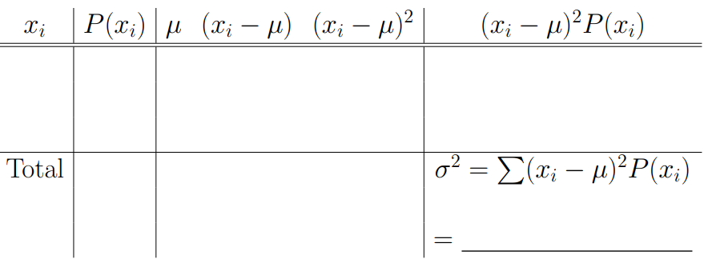</img>
    
   The standard deviation is $\sigma$ = ________________
   
   
4.  Interpret the value of the expected profit, $\mu$.

**Example/Exercise: 40% of all voters support Proposition A. If a random sample of 10 voters is polled. Find the following probabilities.**

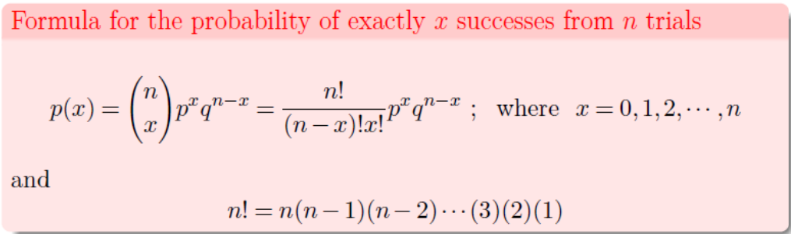</img>     
    
1.  What is the probability that exactly five of them support the proposition?
     
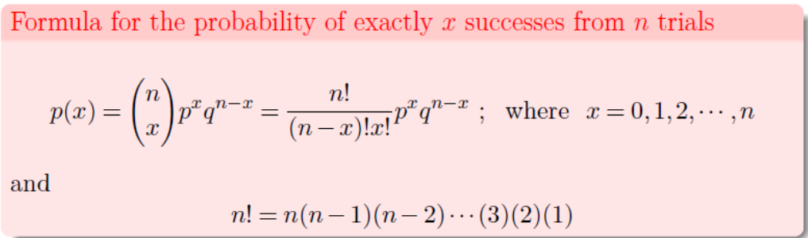</img>   

2.  What is the probability that five or six of them support the proposition?

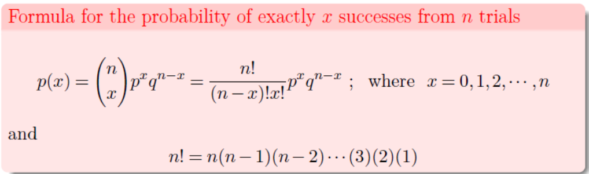</img>

3.  What is the probability that at least three of them support the proposition?

**Exercise:** the manufacturer of the ColorSmart-5000 television set claims that 95% of 
its sets last at least five years without requiring a single repair. Suppose that we contact 8 randomly selected ColorSmart-5000 purchasers five years after they purchased their sets 
and ask each purchaser: Have you needed any repair for your ColorSmart-5000 TV set 
during the first 5 years after purchasing the set?

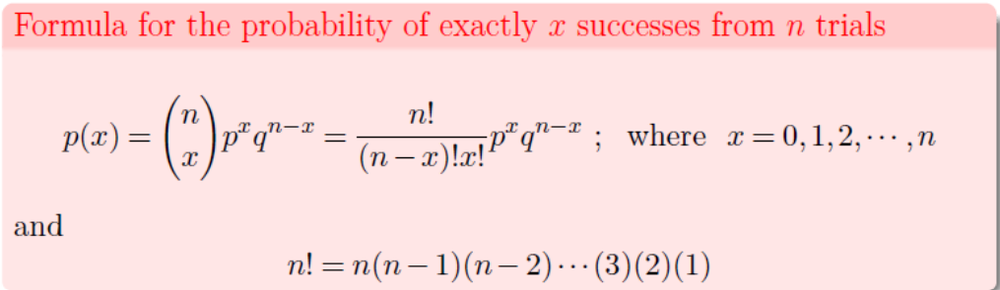</img>

1. Find the probability that exactly 7 customers needed at least one repair during the first 5 years.

2. Find the probability that at least 7 purchasers needed at least one repair during the first 5 years.

## Answers

Exercise: Profit from crop yield under different weather condi-tions (X).
1. Determine the missing probability in the following distribution.

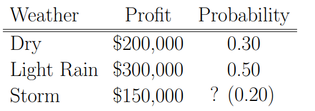</img>

2. Find the expected profit from this crop, $\mu$.

$$
\begin{aligned}
\mu &= \sum{x_i}P(x_i) \\
    &= \$200k \cdot 0.3 + \$300k \cdot 0.5 + \$150k \cdot 0.2 \\
    &= \$60k + \$150k + \$30k = \$240k
\end{aligned}
$$

3. Find the variance, $\sigma^2$ and the standard deviation, $\sigma$.

$$
\begin{aligned}
\sigma^2 &= \sum(x_i-\mu)^2P(x_i) \\
&= (\$200k-\$240k)^2 \ . 0.3 + (\$300k-\$240k)^2 \ . 0.5 + (\$150k-\$240)^2 . 0.2 \\
&= \$^2 3,900, 000, 000 \\
\end{aligned}
$$

The standard deviation is $\sigma = \sqrt{\$^2 3,900,000,000}$ = $62,450

4. Interpret the value of the expected profit, $\mu$.

The expected profit represents the long-run average, the expected profit on average in the future.

**Example/Exercise: 40% of all voters support Proposition A. If a random sample of 10 voters is polled. Find the following probabilities.**

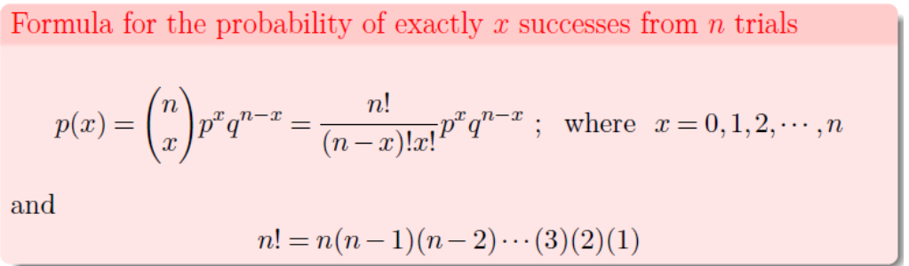</img>

1.  What is the probability that exactly five of them support the proposition?

$$
\begin{aligned}
P(X=5)&=\frac{10!}{(10-5)!5!}(0.40)^5(0.60)^{10-5} \\
&=\frac{10!}{5!5!}(0.40)^5(0.60)^5 \\
&=(252)(0.01024)(0.07776) \\
&=0.2007
\end{aligned}
$$

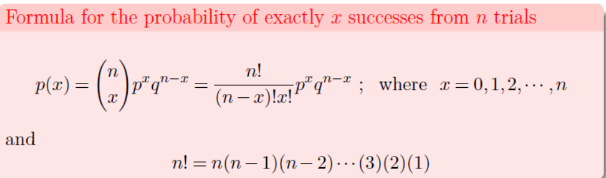</img>

2.  What is the probability that five or six of them support the proposition?

$$
\begin{aligned}
P(X=5)+P(X=6)&=0.2007+\frac{10!}{(10-6)!6!}(0.40)^6(0.60)^{10-6} \\
&=0.2007+\frac{10!}{4!6!}(0.40)^6(0.60)^4 \\
&=0.2007+(210)(0.004096)(0.1296) \\
&=0.2007+0.1115 \\
&=0.312
\end{aligned}
$$

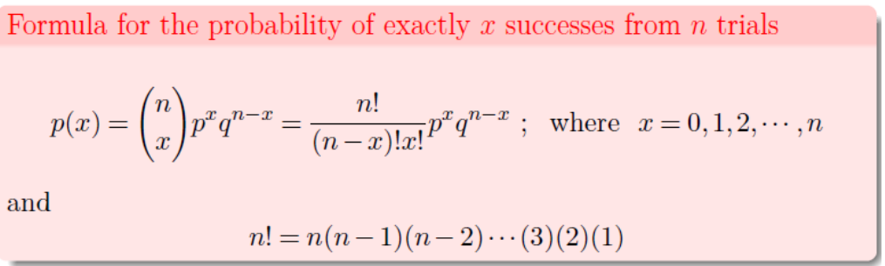</img>

3. What is the probability that at least three of them support the proposition?

$$
\begin{aligned}
P(x \ge 3) &= P(X=3)+P(X=4)+P(X=5)+P(X=6)+...+P(X=10) \\
&=1-[P(X=0)+P(X=1)+P(X=2)] \\
&=1-[\frac{10!}{0!10!}(0.40)^0(0.60)^{10}+\frac{10!}{1!9!}(0.40)^1(0.60)^9+\frac{10!}{2!8!}(0.40)^2(0.60)^8] \\
&=1-[(1)(1)(0.0060)+(10)(0.40)(0.0101)+(45)(0.16)(0.0168)] \\
&=1-[0.0060+0.0403+0.1209] \\
&=1-0.1672 = 0.8328
\end{aligned}
$$

**Exercise:** the manufacturer of the ColorSmart-5000 television set claims that 95% of 
its sets last at least five years without requiring a single repair. Suppose that we contact 8 randomly selected ColorSmart-5000 purchasers five years after they purchased their sets and ask each purchaser: Have you needed any repair for your ColorSmart-5000 TV set during the first 5 years after purchasing the set?

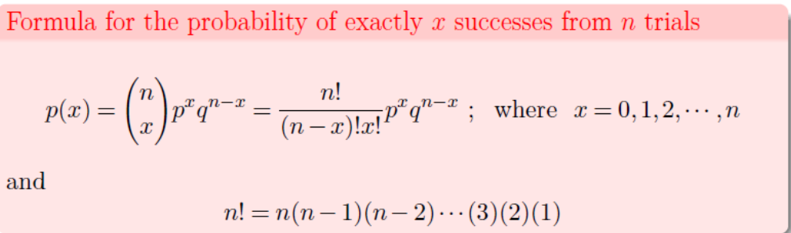</img>

1. Find the probability that exactly 7 customers needed at least one repair during the first 5years.

$$
\begin{aligned}
P(X=7)&=\frac{8!}{(8-7)!7!}(0.05)^7(0.95)^{8-7} \\
&=\frac{8!}{1!7!}(0.05)^7(0.95)^1 \\
&=0.0000000059375
\end{aligned}
$$

2. Find the probability that at least 7 purchasers needed at least one repair during the first 5years.

$$
\begin{aligned}
P(X=7)&=P(X=7)+P(X=8)\\
&=0.0000000059375+\frac{8!}{(8-8)!8!}(0.05)^8(0.95)^{8-8} \\
&=0.0000000059375+0.0000000000390625 \\
&=0.0000000059765625
\end{aligned}
$$

